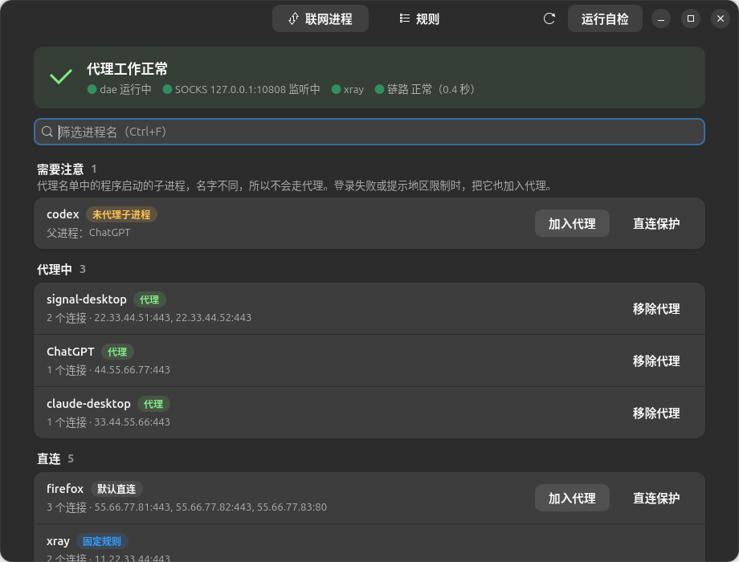
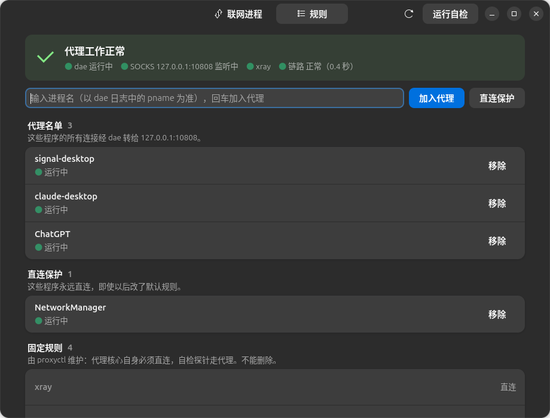
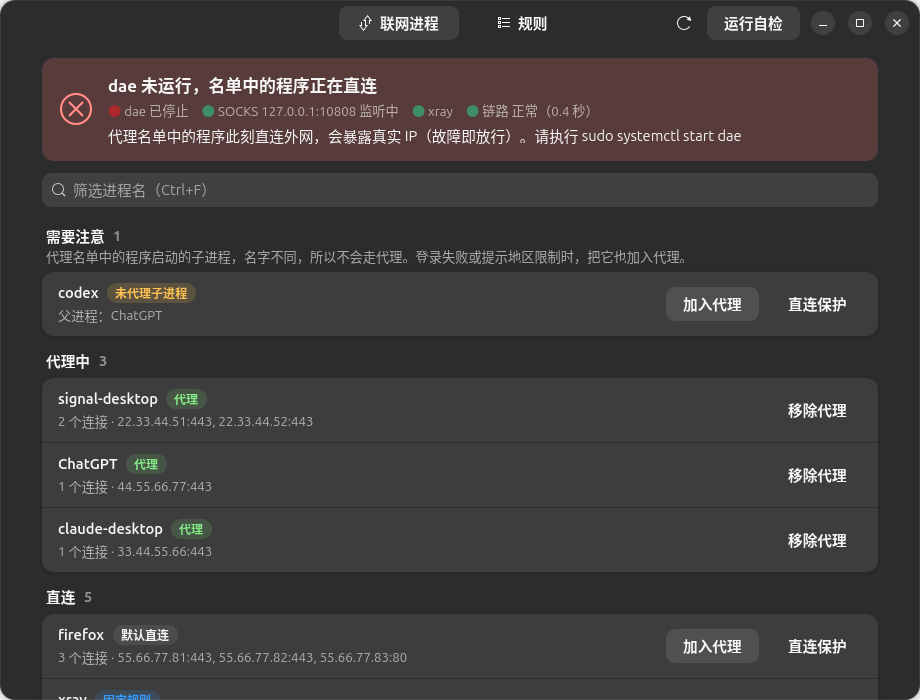

# proxyctl —— Linux 上基于 dae 的“按应用代理”管理工具

**只让你指定的程序走代理，其他程序一律直连。** 在图形界面里点一下，或者一条命令，就能把一个程序加入代理名单。

proxyctl 的体验接近 Windows 上的 Proxifier：它负责管理 [dae](https://github.com/daeuniverse/dae) 的分流规则，
每次修改都会自动校验、生效，出错时自动回滚，不会把你的网络配置改坏。



<sub>截图中的进程和 IP 地址均为演示数据。</sub>

> 目前只在 Ubuntu（GNOME 桌面）+ dae + v2rayN（xray 内核）的组合上实际使用过。
> 其他发行版、桌面环境或代理核心（sing-box、mihomo）理论上可用，欢迎反馈问题。
> 界面和输出目前只有中文。

每个版本改了什么，见 [CHANGELOG.md](CHANGELOG.md) 或 [Releases](https://github.com/atmago/dae-proxyctl/releases) 页面。

---

## 目录

* [它解决什么问题](#它解决什么问题)
* [它是怎么工作的](#它是怎么工作的)
* [安装前先确认](#安装前先确认)
* [手把手安装教程](#手把手安装教程)
  * [第 1 步：准备代理客户端（v2rayN）](#第-1-步准备代理客户端v2rayn)
  * [第 2 步：安装 dae](#第-2-步安装-dae)
  * [第 3 步：写 dae 配置文件](#第-3-步写-dae-配置文件)
  * [第 4 步：启动 dae](#第-4-步启动-dae)
  * [第 5 步：安装 proxyctl](#第-5-步安装-proxyctl)
  * [第 6 步：自检](#第-6-步自检)
  * [第 7 步：把第一个程序加入代理](#第-7-步把第一个程序加入代理)
  * [第 8 步：开机自启（可选）](#第-8-步开机自启可选)
* [日常使用](#日常使用)
* [出问题时会怎样（故障模式）](#出问题时会怎样故障模式)
* [常见问题](#常见问题)
* [参考手册](#参考手册)（配置文件、全部命令、检查项、工作细节）
* [卸载](#卸载)
* [开发与测试](#开发与测试)

---

## 它解决什么问题

在 Linux 上用代理，常见的做法有两种，各有麻烦：

| 做法 | 问题 |
|---|---|
| **系统代理**（在系统设置里填代理地址） | 很多程序根本不看系统代理，例如 Signal、不少 Electron 应用、命令行工具。设置了也照样直连。 |
| **TUN 模式 / 全局代理**（代理客户端接管整台电脑的流量） | 所有程序都进了代理：国内网站变慢，网银、炒股软件、公司 VPN 可能因为 IP 变化出问题，有些服务甚至会封号。 |

你真正想要的往往是：**只有 Signal、Claude、ChatGPT 这几个程序走代理，其他全部直连**。

Windows 上有 Proxifier 可以做到。Linux 上，[dae](https://github.com/daeuniverse/dae) 可以按**进程名**分流，
能力足够，但需要手工编辑 `/etc/dae/config.dae`：写错一个字符 dae 就启动失败，而且不知道程序的进程名叫什么。

proxyctl 就是 dae 的“遥控器”：

* **看得到**：列出此刻正在联网的程序，告诉你它们叫什么、走的是代理还是直连；
* **点一下**：选中程序加入代理名单，proxyctl 负责改配置、校验、让 dae 生效；
* **改不坏**：每次修改前自动备份，校验不通过或 dae 出错就自动恢复原配置；
* **有提醒**：dae 停了、代理断了、节点变慢时弹出桌面通知。

## 它是怎么工作的

```
你的程序（Signal、Claude……）
   │
   ▼
dae：在内核里看“这个连接是哪个程序发的”
   ├─ 在代理名单里 ──> 本机代理客户端（v2rayN 等，127.0.0.1:10808）──> 远程节点 ──> 外网
   └─ 不在名单里   ──> 直连
```

分工很简单：

* **代理客户端**（v2rayN / Clash 系客户端）负责连接你的节点，在本机开一个 SOCKS5 端口；
* **dae** 负责分流：按进程名决定每个连接走代理还是直连。不需要 TUN，也不需要系统代理；
* **proxyctl** 只负责管理 dae 的名单。它自己不碰任何网络流量。

几个会反复出现的词：

| 词 | 意思 |
|---|---|
| 进程名（pname） | 程序在系统里运行时的名字，例如 Signal 是 `signal-desktop`。dae 只认这个名字。 |
| 代理名单 | 要走代理的进程名。 |
| 直连保护 | 无论如何都必须直连的进程名，例如代理客户端自己、NetworkManager。 |
| SOCKS5 地址 | 代理客户端在本机提供的代理入口，v2rayN 默认是 `127.0.0.1:10808`。 |

## 安装前先确认

| 要求 | 怎么确认 |
|---|---|
| **Linux 内核 5.17 或更高**（dae 的要求） | 执行 `uname -r`，例如 `6.8.0-45-generic` 就满足。Ubuntu 24.04 及以后、Debian 12 及以后的默认内核都满足。 |
| **内核支持 BTF**（dae 的要求） | 执行 `ls /sys/kernel/btf/vmlinux`，能看到这个文件就行。主流发行版默认都有。 |
| **使用 systemd 和 apt** | Ubuntu、Debian、Linux Mint 等。其他发行版也能用，但下面教程里的安装命令要自己换。 |
| **一个能用的代理节点** | 本教程不涉及节点从哪里来。 |
| **Python 3** | Ubuntu / Debian 自带。 |

## 手把手安装教程

下面每一步都在“终端”里执行（Ubuntu 里按 `Ctrl` + `Alt` + `T` 打开）。
每个代码框是一条命令，复制进终端、回车即可。遇到 `sudo` 会要求输入你的登录密码，输入时屏幕上不显示字符，这是正常的。

### 第 1 步：准备代理客户端（v2rayN）

dae 自己不连接节点，它要把流量交给本机的代理客户端。这一步以 **v2rayN** 为例；如果你已经有能用的代理客户端，确认下面三点即可。

1. 从 [v2rayN 的发布页](https://github.com/2dust/v2rayN/releases) 下载 Linux 版并安装，导入你的节点，选中一个节点。
2. 在 v2rayN 的设置里找到“本地监听端口”（socks 端口），**记下这个端口号**，默认是 `10808`。
3. **关闭 v2rayN 的“系统代理”和“TUN 模式”**：在 v2rayN 主界面底部把系统代理设为“清除系统代理”，TUN 开关保持关闭。
   开着它们，所有程序都会被代理，按应用分流就失去了意义，还会干扰 proxyctl 的诊断。

确认代理端口能用（把 `10808` 换成你的端口）：

```bash
curl -x socks5h://127.0.0.1:10808 https://ifconfig.me/ip; echo
```

应该显示一个**节点的 IP**，而不是你自己的 IP。如果报错，先在 v2rayN 里换个节点或检查端口，这一步不通，后面都不会通。

> 为什么用 `ifconfig.me`：测试要找一个**直连和走代理都能打开**的网站，才能对比出口 IP。
> 国内网络下 `api.ipify.org`、`https://1.1.1.1` 直连经常超时，不适合做对比；
> 另外不要用 `http://`（不带 s）访问 1.1.1.1，它只会返回一个跳转页面，看起来像“没有输出”。

> 用的是 Clash Verge、mihomo 或 sing-box 客户端？找到它的 SOCKS 端口或“混合端口（mixed-port）”，后面把 `10808` 都换成它。
> 另外记下它的内核进程名：代理客户端启动后执行 `ss -ltnp | grep 你的端口`，括号里的 `(("xxx",...` 就是进程名，第 3 步要用。

### 第 2 步：安装 dae

dae 官方提供了 apt 软件源。这个源在国内有时打不开，所以下面的命令都**经过第 1 步的代理下载**（把 `10808` 换成你的端口），
这样不管能不能直连都能装上。

**2.1 添加 dae 软件源。** 先查看 apt 的版本：

```bash
apt --version
```

如果显示 `apt 3.x`（Ubuntu 25.04 及以后、Debian 13 及以后），执行：

```bash
sudo curl -x socks5h://127.0.0.1:10808 -fsSL -o /etc/apt/sources.list.d/daeuniverse.sources https://daeuniverse.pages.dev/daeuniverse.sources
```

如果显示 `apt 2.x`（Ubuntu 24.04、Debian 12 等），执行这一条：

```bash
sudo curl -x socks5h://127.0.0.1:10808 -fsSL -o /etc/apt/sources.list.d/daeuniverse.list https://daeuniverse.pages.dev/daeuniverse.list
```

**2.2 导入软件源的签名密钥**（apt 用它确认下载的软件没有被篡改）：

```bash
sudo curl -x socks5h://127.0.0.1:10808 -fsSL -o /usr/share/keyrings/daeuniverse-archive-goose.gpg https://daeuniverse.pages.dev/daeuniverse-archive-goose.gpg
```

**2.3 安装 dae**（`-o Acquire...` 这两段让 apt 也走代理）：

```bash
sudo apt -o Acquire::http::Proxy=socks5h://127.0.0.1:10808 -o Acquire::https::Proxy=socks5h://127.0.0.1:10808 update
```

```bash
sudo apt -o Acquire::http::Proxy=socks5h://127.0.0.1:10808 -o Acquire::https::Proxy=socks5h://127.0.0.1:10808 install dae
```

装好后确认一下：

```bash
dae --version
```

能显示版本号（例如 `dae version v2.1.1`）就说明装好了。注意是 `dae --version`，写成 `dae version` 会报错。
安装时会顺带装上 `v2ray-rules-dat`（分流用的规则数据），这是正常的。
上面的命令来自 dae 官方的 [Linux 软件源说明](https://github.com/daeuniverse/repo-for-linux)，如有变化以官方为准。

### 第 3 步：写 dae 配置文件

dae 的配置文件是 `/etc/dae/config.dae`。用下面的命令打开编辑器（`nano` 是终端里的简单编辑器）：

```bash
sudo nano /etc/dae/config.dae
```

把下面的内容整段粘贴进去（在 nano 里用 `Ctrl` + `Shift` + `V` 粘贴）。
**如果你的 SOCKS 端口不是 10808，改掉 `127.0.0.1:10808` 这一处；如果代理客户端的内核不是 xray，把 `pname(xray)` 换成第 1 步查到的进程名。**

```
global {
    # 自动选择上网的网卡（有线 / Wi-Fi 都行）
    wan_interface: auto
    log_level: info
    auto_config_kernel_parameter: true
}

node {
    # 代理客户端提供的本地 SOCKS5 地址，按你的客户端修改端口
    local: 'socks5://127.0.0.1:10808'
}

group {
    proxy {
        filter: name(local)
        policy: fixed(0)
    }
}

routing {
    # 代理客户端的内核必须直连，否则会形成回环
    pname(xray) -> must_direct

    # 网络管理器保持直连
    pname(NetworkManager) -> must_direct

    # 其他所有程序默认直连
    fallback: direct
}
```

保存并退出：按 `Ctrl` + `O`，回车确认，再按 `Ctrl` + `X`。

这份配置的意思是：dae 只认识一个出口 `local`（你的代理客户端），`proxy` 组就用它；
路由规则里暂时**没有任何程序走代理**，全部直连。之后往名单里加程序的事交给 proxyctl。

dae 要求配置文件只有 root 能读，否则拒绝启动。设置权限：

```bash
sudo chmod 600 /etc/dae/config.dae
```

检查配置有没有写错：

```bash
sudo dae validate -c /etc/dae/config.dae
```

没有任何输出就是正确的。如果报错，按提示回到编辑器修改，常见原因是粘贴时少了括号或引号。

如果看到下面这样的报错，说明上一步的权限没设好，重新执行一次 `sudo chmod 600 /etc/dae/config.dae` 即可：

```
permissions 0644 for '/etc/dae/config.dae' are too open; ... suggest 0640 or 0600
```

### 第 4 步：启动 dae

```bash
sudo systemctl start dae
```

查看状态：

```bash
systemctl status dae --no-pager
```

看到绿色的 `active (running)` 就说明启动成功。这时打开几个网页，上网应该和之前完全一样，因为目前所有程序都是直连。

再看一眼 dae 的日志：

```bash
sudo journalctl -u dae -n 30 --no-pager
```

正常情况下能看到类似这几行：

```
INFO Loading routing rules into kernel space (BPF)...
INFO Bind to WAN: wlp3s0
INFO Total startup time: 731.883537ms
```

`Bind to WAN:` 后面是你上网用的网卡（Wi-Fi 一般是 `wlp...` 或 `wlan0`，有线一般是 `enp...` 或 `eth0`）。
如果显示 `failed`，同样看这份日志，最后几行会写明原因。

不用担心 dae 把网络搞坏：随时可以执行 `sudo systemctl stop dae`，停止后所有程序立即恢复直连，不会残留任何设置。

### 第 5 步：安装 proxyctl

**5.1 安装依赖。** 这些都来自系统自带的软件源，不需要代理：

```bash
sudo apt install git curl iproute2 python3-gi gir1.2-gtk-4.0 gir1.2-adw-1 libnotify-bin pkexec
```

其中 `python3-gi`、`gir1.2-gtk-4.0`、`gir1.2-adw-1` 用于图形界面，`libnotify-bin` 用于桌面通知，`pkexec` 用于在图形界面里弹出授权框。
只用命令行的话，缺少它们也能用。

**5.2 下载 proxyctl。** 访问 GitHub 如果不稳定，同样经过代理下载：

```bash
git -c http.proxy=socks5h://127.0.0.1:10808 clone https://github.com/atmago/dae-proxyctl.git
```

```bash
cd dae-proxyctl
```

**5.3 运行安装脚本：**

```bash
sudo ./install.sh
```

安装脚本会：

* 检查依赖，缺少必需的程序会直接停下，不做任何修改；
* 把 `proxyctl` 装到 `/usr/local/bin/`，并在应用列表里添加 Proxyctl 图标（搜索“代理”也能找到）；
* 从 dae 配置里自动识别你的 SOCKS5 地址，写入 `/etc/proxyctl.conf`；
* 在 dae 配置的 `routing { }` 开头加入 proxyctl 管理的三个区块，并把已有的 `pname` 规则迁移进去（改之前会自动备份）；
* 设置 dae 异常退出时自动重启；
* 安装一个每 15 秒运行一次的健康检查，出问题时弹出桌面通知。

最后看到“安装完成”就成功了。脚本可以重复执行，重复执行不会产生重复内容。

### 第 6 步：自检

```bash
proxyctl test
```

它会真正发几次请求来验证整条链路：

1. 直接经过 SOCKS5 访问，得到节点的出口 IP：确认代理客户端能用；
2. 用一个名字在代理名单里的测试程序访问：出口 IP 应该**等于**节点 IP，说明 dae 的分流生效了；
3. 用一个不在任何名单里的测试程序访问：出口 IP 应该**不等于**节点 IP，说明其他程序确实直连；
4. 连续新建 5 个代理连接并计时，检查节点是否太慢；
5. 检查有没有开着 TUN 网卡。

正常时的输出类似这样（IP 为示例）：

```
dae 服务状态：active；SOCKS5 127.0.0.1:10808：监听中
[PASS] 1. 通过 SOCKS5 直接访问 https://ifconfig.me/ip，得到代理出口 IP：203.0.113.7
       说明代理客户端（v2rayN 等）与远程节点工作正常。
[PASS] 2. proxyctl-probe 得到 203.0.113.7，与代理出口一致
       说明 dae 按进程名把名单程序送进了代理。
[PASS] 3. proxyctl-direct 得到 198.51.100.8，与代理出口不同（默认直连正常）
[PASS] 4. 新建代理连接速度正常：中位 0.4 秒
       连续新开 5 条连接，耗时（秒）：0.4、0.4、0.5、0.4、0.4
结论：全部通过。
```

前 3 项都是 PASS 就说明一切正常。某一项失败时，输出里会用中文说明原因和处理办法。

再做一次完整的健康检查：

```bash
sudo proxyctl check
```

每一项会显示 OK / WARN / FAIL。WARN 是提醒，不影响使用；FAIL 需要处理，输出里会说明怎么做。

### 第 7 步：把第一个程序加入代理

以 Signal 为例，其他程序同理。

**用图形界面（推荐）：**

1. 先打开 Signal，让它联网一下（登录、刷新都行）；
2. 在应用列表里打开 **Proxyctl**；
3. 在“联网进程”页找到 `signal-desktop`，点“**加入代理**”，输入密码授权；
4. 底部提示成功后，Signal 会在几十秒内自动重连，之后就走代理了。

“规则”页可以查看和管理名单，也可以直接输入进程名添加：



**用命令行：**

```bash
proxyctl list
```

它会列出正在联网的程序和它们的进程名，找到要代理的那个，然后：

```bash
proxyctl add signal-desktop
```

也可以用 `proxyctl pick`：列出程序后直接输入编号加入。

**进程名不一定是程序的名字。** 桌面图标上写的是“Signal”，进程名却是 `signal-desktop`。
proxyctl 的列表里显示的就是进程名；也可以打开程序后自己查（把 `signal` 换成程序名里的关键词）：

```bash
ps -eo pid,comm,args | grep -i signal | grep -v grep
```

第二列（`comm`）就是进程名。Signal 这类 Electron 程序会有很多个进程，但在 Linux 上它们的名字通常都一样，加一个就够了。

**加入后还是连不上？** 很多程序真正联网的是名字不同的子进程。
例如 ChatGPT 桌面版的登录由子进程 `codex` 完成，只加入 `ChatGPT` 会被提示地区不支持。
proxyctl 会把这类进程显示为“**未代理子进程**”，把它也加入即可。详见[常见问题](#常见问题)。

**Signal 这类“代理不可用时绝不能启动”的程序**，可以加一个启动守卫：
dae 或代理没准备好时，点图标会拒绝启动并弹出提示，防止它直连。执行（不要加 sudo）：

```bash
proxyctl guard-desktop signal-desktop.desktop
```

### 第 8 步：开机自启（可选）

安装脚本**不会**替你设置 dae 开机自启，要不要自启由你决定。
建议先用几天，把常用的程序都加进名单、确认都正常后再开启。需要的话：

```bash
sudo systemctl enable dae
```

代理客户端也要设成登录后自动启动（v2rayN 在设置里勾选“开机启动”）。
开机时 dae 会比 v2rayN 先启动，这段时间名单里的程序连不上外网，但不会直连泄露；登录、v2rayN 启动后会自动恢复。

**请注意**：如果 dae 没有运行，名单里的程序会**直接连外网**（见下面的“故障模式”）。
设置了开机自启，再配合启动守卫和健康检查通知，就能避免这种情况。

## 日常使用

大部分时候只需要打开图形界面 **Proxyctl**：

* **顶部状态卡**：一句话告诉你代理是否正常，出问题时变色并给出处理建议；
* **联网进程页**：按“需要注意 / 代理中 / 直连 / 最近断开”分组，一键加入代理、直连保护或移除，`Ctrl` + `F` 搜索；
* **规则页**：查看和管理代理名单、直连保护名单，也可以手动输入进程名添加；
* **延迟页**：过去 6 小时 / 24 小时 / 7 天里每次新建代理连接的耗时曲线，底部色带标出当时用的是哪个内核，
  下方列出异常时段（连续失败或超过 3 秒）和内核切换，鼠标悬停可看每个点的时间和耗时；
* **右上角**：运行自检；菜单里可以导入 / 导出规则，“关于 proxyctl”显示版本号、作者和 GitHub 地址。

常用命令：

| 想做的事 | 命令 |
|---|---|
| 看哪些程序在联网、走的是哪条路 | `proxyctl list` |
| 把程序加入代理 | `proxyctl add <进程名>` 或 `proxyctl pick` |
| 把程序移出代理 | `proxyctl remove <进程名>` |
| 查看当前名单 | `proxyctl rules` |
| 代理好像不通了 | `proxyctl test`，然后 `sudo proxyctl check` |
| 最近是不是节点变慢了、从什么时候开始的 | `proxyctl history`（GUI：延迟页） |
| 改坏了想恢复 | `sudo proxyctl backups`，然后 `sudo proxyctl restore <备份名>` |
| 想知道代理程序的 DNS 怎么走 | `proxyctl dns`（GUI：DNS 页） |
| 不想让运营商看到代理程序查询的域名 | `sudo proxyctl dns --protect on`（GUI：DNS 页 → DNS 防泄漏 → 开启） |
| 把规则搬到另一台电脑 | 旧电脑 `proxyctl export 规则.json`，新电脑 `sudo proxyctl import 规则.json`（GUI：右上角菜单 → 导入规则 / 导出规则） |

**每次修改名单，dae 都会重新加载，正在走代理的连接会断开一下**，程序一般会自动重连；Signal 重连较慢，可能要 1～2 分钟。

## 出问题时会怎样（故障模式）

出问题时，图形界面顶部的状态卡会变色，并直接告诉你该怎么处理。例如 dae 没有运行时：



| 情况 | 结果 | 说明 |
|---|---|---|
| **dae 停止**（崩溃、被停止、开机未启动） | **故障即放行** | 没有任何进程被拦截，名单中的程序会**直接连接外网**，暴露真实 IP。check 会报 FAIL，定时器最迟约 15 秒内弹通知、恢复时再通知；`proxyctl run` / guard-desktop 会阻止被守卫的程序启动（但无法影响已在运行的程序）。 |
| **xray / v2rayN 停止**，或节点不可用 | **故障即断开** | dae 仍然把名单程序送进 proxy 组，但 SOCKS5 不通，这些程序无法联网，不会泄露。xray 在运行但连不上节点时，链路探测会在约 2～3 分钟内报警。 |
| 新配置未通过 validate | 不生效 | 原配置不变。 |
| reload 失败，或 reload 后 dae 退出 | 自动回滚 | 恢复原配置并再次 reload；若 dae 仍未恢复，会提示 `sudo systemctl restart dae`。drop-in 的 `Restart=on-failure` 也会让 systemd 尝试重启 dae。 |
| 节点很慢（高峰期拥堵、线路限速） | 能用但很卡 | 经代理每个新连接要好几秒。Claude 这类一次性请求还能用，Signal 这类长连接会反复显示离线。链路探测连续 3 次超过 3 秒会提醒“代理很慢”，在 v2rayN 中更换节点即可。 |
| 修改名单（add / remove / protect / unprotect / restore） | 短暂断线 | dae 重新加载会断开所有正在走代理的连接，程序会自动重连；Signal 重连较慢，可能离线几十秒到 1～2 分钟。命令输出和 GUI 对话框会提示这一点。 |
| 应用改名 / 同名程序 | 规则按名字匹配 | pname 只看进程名，改名即可绕过；同名的其他程序也会被代理。这是 dae pname 的固有性质。 |

## 常见问题

**加入名单后应用还是直连？**
先 `proxyctl test` 看链路是否正常，再 `sudo journalctl -u dae -f` 看该应用实际的 pname。
很多应用真正联网的是子进程（例如 `xxx-helper`、`WebKitNetworkProcess`），要加入的是子进程的名字。
另外已经建立的长连接不会被重新分流，重启应用即可。

**为什么不能 add python3 / node / java / curl？**
dae 只按名字匹配，加入 `python3` 会把电脑上所有 Python 程序（例如量化交易程序）一起送进代理。
这类程序请在程序自己的设置里配置 SOCKS5 代理，或者设置环境变量，例如 `ALL_PROXY=socks5h://127.0.0.1:10808`。
完整列表见[进程名规则](#进程名规则)。（init 时如果旧配置里已有这类名字，会原样迁移并给出警告，建议 `proxyctl remove`。）

**非 root 时 list / rules 显示“未知”或“来自缓存”？**
`/etc/dae/config.dae` 必须是 0600/0640，普通用户读不到。proxyctl 每次以 root 修改或检查配置时，
会把名单（只有进程名）写入 `/var/lib/proxyctl/rules.json`（0644），非 root 命令和 GUI 读取这个缓存。
另外非 root 时 ss 只能看到当前用户自己的进程。

**重启后名单程序都连不上？**
先运行 `proxyctl test`（**不要先开 v2rayN 的 TUN 模式**：TUN 与 dae 同时开会互相叠加，名单被绕过，诊断也会被干扰）。
第 1 步就 FAIL 说明 xray 连不上节点，在 v2rayN 中测试或更换节点；第 1 步 PASS、第 2 步 FAIL 才是 dae 的问题。
开机时 dae 会比 v2rayN（登录后自启）早启动，这段时间名单程序连不上是正常的（故障即断开），登录后会自动恢复。

**Signal 显示离线，但 `proxyctl test` 全部通过？**
先看是不是节点太慢：`proxyctl check --basic` 或 GUI 顶栏的“链路”会显示每次探测的耗时，正常应在 1 秒左右。
如果要好几秒，在 v2rayN 中测试延迟并更换节点，然后从托盘退出 Signal 再重新打开。
刚修改过名单、刚重启过 v2rayN 或 dae 时，Signal 也会离线一会儿，等 1～2 分钟或重开 Signal 即可。

**Claude 反复显示 "Request failed · Retrying"，但 v2rayN 里节点延迟只有几百毫秒？**
看 `proxyctl test` 的第 4 项：它连续新开 5 条代理连接并计时，中位超过 1.5 秒（`connect_slow`）就给出 WARN。
v2rayN 的延迟测试反映的是已建好连接上的一次请求，“新建连接很慢”时它照样显示几百毫秒，浏览网页也感觉不到；
但 Claude 这类频繁新开连接的应用会反复超时。解决办法：在 v2rayN 中双击当前节点，开启“Mux 多路复用”，再点“重启服务”
（v2rayN 7.x 的 Mux 开关跟着节点走，换节点后要重新开；设置页里的“sing-box Mux 协议”对 xray 内核无效）。
第 5 项检测到 TUN 网卡时也会给出 WARN，请关闭 v2rayN 的 TUN 模式。警告不影响 test 的退出码。

**我的代理客户端端口不是 10808，要改哪里？**
两处要一致：dae 配置里 `node` 段的 socks5 地址，以及 `/etc/proxyctl.conf` 里的 `socks = `（安装时会自动识别，一般不用手改）。
`sudo proxyctl check` 发现两者不一致时会给出警告。

**IPv6？**
如果 check 提示有全局 IPv6 地址，请用 `/usr/local/lib/proxyctl/proxyctl-probe -6 -sS https://ifconfig.me/ip`
单独测试 IPv6 流量是否也走了代理。

**DNS 会泄露吗？**
默认会：应用把域名交给 systemd-resolved，由它以明文发给路由器，运营商能看到查询了哪些域名（连接本身仍走代理）。
`proxyctl dns` 和 GUI 的 DNS 页会显示每个程序实际的 DNS 走向。

所有程序的 DNS 都由 systemd-resolved 统一代发，dae 分不出是替哪个程序查的，所以无法只让代理程序的 DNS 走代理，
只能按域名区分。`sudo proxyctl dns --protect on`（DNS 防泄漏）会：

* 在配置末尾加入带标记的 `dns` 区块：局域网、反向解析和国内域名（`geosite:private`、`geosite:cn`、`.lan`）照旧交给原来的 DNS，
  其余域名交给 dae 查询 8.8.8.8；
* 在 routing 的代理名单区块之后加入带标记的 `dip(8.8.8.8) -> proxy`，让这些查询经代理发出，运营商只能看到加密的代理流量。

代价：对全系统生效（直连程序查询国外域名也经代理，首次约慢 0.4 秒）；代理不可用时国外域名暂时解析失败；
直连访问国外网站时拿到的地址按代理出口的位置分配。需要 `/usr/share/dae/geosite.dat`。
如果配置里已经有你自己写的 `dns` 区块，proxyctl 拒绝开启，不改动你的 DNS 设置。
`sudo proxyctl dns --protect off` 删除这两处，配置恢复原样。开启和关闭都走同样的备份 / validate / reload / 回滚流程。

注意不要把 dae 的 `dial_mode: domain` 简单等同于 Proxifier 的“远程 DNS”，两者机制并不相同，对 DNS 有严格要求时请单独测试。

**如何回到安装前的配置？**
`sudo proxyctl backups` 找到最早的 `*-init.dae`，然后 `sudo proxyctl restore <它>`。

## 参考手册

### 配置结构

proxyctl 只编辑 `/etc/dae/config.dae` 里 `routing { }` 开头的三个管理区块。dae 的 routing 规则**从上到下，首条命中生效**，
所以三个区块放在 routing 最前面，顺序固定为：安全区块 → 直连保护 → 代理名单。

```
routing {
    # >>> proxyctl:safety (do not edit) >>>
    pname(xray) -> must_direct          # 代理核心必须直连，否则形成回环
    pname(sing-box) -> must_direct
    pname(mihomo) -> must_direct
    pname(proxyctl-probe) -> proxy      # proxyctl test 使用的探针
    # <<< proxyctl:safety <
    # >>> proxyctl:direct >>>
    pname(NetworkManager) -> must_direct
    # <<< proxyctl:direct <
    # >>> proxyctl:proxy >>>
    pname(signal-desktop) -> proxy
    # <<< proxyctl:proxy <

    # 其他所有程序默认直连
    fallback: direct
}
```

管理区块之外的所有内容（global、node、group、dns、其他 routing 规则、注释、空行）
proxyctl 都逐字节原样保留（唯一的例外是你主动开启 DNS 防泄漏时加入的两个带标记区域）。请不要手工编辑管理区块内部；如果标记被破坏，proxyctl 会拒绝修改。

如果你的代理核心进程名不在安全区块里（例如某些客户端把 mihomo 改名为 `verge-mihomo`），
用 `proxyctl protect <进程名>` 把它加入直连保护。

### 每次写配置都是一个事务

1. 加文件锁（`/var/lib/proxyctl/lock`），防止两个 proxyctl 同时修改；
2. 备份原配置到 `/var/lib/proxyctl/backups/`（保留最近 30 份）；
3. 在 `/etc/dae/` 下生成临时文件（root:root，0600）；
4. `dae validate -c 临时文件`，不通过就放弃，原配置不动；
5. 原子 `rename` 替换 `/etc/dae/config.dae`；
6. 若 dae 正在运行，`systemctl reload dae`，然后确认 `systemctl is-active dae` 仍是 active；
7. 任何一步失败都自动恢复原配置（如果已经 reload，会再 reload 一次），并给出中文说明。

### install.sh 安装了什么

* 检查依赖：python3、dae、curl、ss、systemctl（必需）；notify-send、pkexec、PyGObject（可选，缺少只警告）；
* 安装 `/usr/local/bin/proxyctl`；把 curl 复制为 `/usr/local/lib/proxyctl/proxyctl-probe` 和 `proxyctl-direct`；
* 创建 `/var/lib/proxyctl/backups`（0700）；
* 创建配置文件 `/etc/proxyctl.conf`（已存在则不动），并从 dae 配置中识别 SOCKS5 节点地址填入；
* 安装图形界面启动器 `/usr/share/applications/proxyctl.desktop`；
* 创建 systemd drop-in `/etc/systemd/system/dae.service.d/proxyctl.conf`（`Restart=on-failure`）并 `daemon-reload`，
  不改动 `/usr/lib` 下的原服务文件；
* 为当前登录用户（`SUDO_USER`）安装 systemd 用户定时器 `proxyctl-check.timer`：每 15 秒执行
  `proxyctl check --quiet --notify --basic`，dae 或代理端口出问题时弹出桌面通知（同一故障 10 分钟内只提醒一次），
  恢复正常时再弹一条“已恢复”通知；
* 执行 `proxyctl init`。

### 配置文件 /etc/proxyctl.conf

proxyctl 的设置写在 `/etc/proxyctl.conf`（`键 = 值`，`#` 开头为注释），修改后立即生效，GUI 和健康检查定时器也会读取。
最常需要改的是 **SOCKS5 地址**：proxyctl 用它检查代理端口、探测链路和做 `test`，必须与 dae 配置中的 socks5 节点一致。

```ini
# v2rayN 默认 127.0.0.1:10808；Clash / mihomo 常见 127.0.0.1:7891
socks = 127.0.0.1:7891
```

| 键 | 默认值 | 说明 |
|---|---|---|
| `socks` | `127.0.0.1:10808` | 代理核心的本地 SOCKS5 地址 |
| `config` | `/etc/dae/config.dae` | dae 配置文件 |
| `service` | `dae` | dae 的 systemd 服务名 |
| `iface` | （空） | 除默认路由接口外，额外检查全局 IPv6 的接口，逗号分隔 |
| `test_url` | `https://ifconfig.me/ip` | `test` 获取出口 IP 的地址 |
| `probe_url` | `https://www.gstatic.com/generate_204` | 链路探测地址 |
| `chain_interval` | `120` | 链路正常时每隔多少秒真正探测一次 |
| `slow_seconds` | `3` | 单次链路探测超过多少秒算慢 |
| `connect_slow` | `1.5` | `test` 中新建代理连接中位耗时的警告阈值（秒） |
| `test_retries` | `3` | `test` 中每个请求最多尝试几次 |
| `gui_recent` | `300` | GUI 保留最近断开进程的秒数 |

同名环境变量 `PROXYCTL_<大写键名>`（例如 `PROXYCTL_SOCKS`）优先于配置文件，但 sudo、pkexec 和 systemd 定时器不会传递环境变量，
日常使用请改配置文件。配置文件必须属于 root 且不能被其他用户写入，否则会被忽略。

### 全部命令

需要 root 的命令（init、add、remove、protect、unprotect、restore、import）在终端里以普通用户运行时，
会自动通过 sudo 重新执行自身；在图形界面里则通过 pkexec 弹出授权框。

| 命令 | 说明 |
|---|---|
| `proxyctl init` | 创建管理区块并迁移已有的 `pname(X) -> proxy` / `-> must_direct` 规则。幂等；已初始化时只检查并修复安全区块。 |
| `proxyctl add <名称>` | 加入代理名单。会校验名称、拒绝通用运行时名称、检查与直连保护的冲突和重复；没有同名进程在运行时只警告。 |
| `proxyctl remove <名称>` | 从代理名单移除。 |
| `proxyctl protect <名称>` | 加入直连保护（`must_direct`）。通用运行时名称可以加入这里，因为直连是安全方向。 |
| `proxyctl unprotect <名称>` | 从直连保护移除。安全区块中的规则不能移除。 |
| `proxyctl rules` | 显示三个区块，以及 routing 中不受 proxyctl 管理的规则。 |
| `proxyctl list` | 列出正在连接外网的进程（排除回环和局域网），按进程名聚合，显示 PID 数、连接数、远端示例、状态（代理 / 直连保护 / 默认直连 / 未代理子进程）和 DNS 走向（直连或代理、明文或加密；代理程序的 DNS 明文直连时标黄）。GUI 的“联网进程”页在状态旁显示同样的 DNS 标签，悬停可看完整路径。 |
| `proxyctl pick` | `list` 的交互版：输入编号，确认后执行 add。 |
| `proxyctl check [--quiet] [--notify] [--basic]` | 只读健康检查，每项输出 OK / WARN / FAIL。退出码：0 全部正常，1 有 WARN，2 有 FAIL。 |
| `proxyctl test` | 端到端自检（见下文）。 |
| `proxyctl run [--wait N] -- <命令...>` | 启动守卫：确认 dae active 且 SOCKS 端口在监听后才启动程序，否则弹通知并拒绝启动。 |
| `proxyctl guard-desktop <x.desktop> [--undo]` | 在 `~/.local/share/applications/` 生成启动器覆盖副本，让它经 `proxyctl run --wait 30 --` 启动。不需要 root，不要加 sudo。 |
| `proxyctl dns [名称]` | 显示代理名单中程序的 DNS 走向：域名解析请求交给谁、是否被 dae 接管、经直连还是代理发往哪个上游、是否加密、谁能看到访问的域名、本地 DNS 污染会不会影响连接。走向相同的程序合并显示；指定名称时可以查看任意进程。GUI 中是“DNS”页。 |
| `proxyctl dns --protect on\|off` | DNS 防泄漏开关（需要 root，见“DNS 会泄露吗？”）。 |
| `proxyctl export [文件]` | 把代理名单和直连保护名单导出为 JSON（省略文件名时输出到终端）。只含进程名，不含节点、订阅等信息，可以放心拷到另一台机器或分享给别人。不需要 root。 |
| `proxyctl import <文件> [--replace]` | 导入 `export` 生成的文件。默认**合并**：只新增，不删除现有条目；加 `--replace` 则让规则与文件完全一致。文件中任何一个名字不合法就整体拒绝；通用运行时名称（如 curl、python3）、安全区块中的名字、与现有规则冲突的名字（合并时）会被跳过并说明原因。同样经过备份 / validate / reload / 回滚流程。 |
| `proxyctl history [--hours N]` | 代理链路延迟记录：最近 N 小时（默认 24，最多 168）的探测次数、中位 / 90 分位 / 最慢耗时、每小时统计、异常时段和内核切换。数据由健康检查定时器写入 `~/.local/state/proxyctl/chain-history.jsonl`，保留 7 天。GUI 中是“延迟”页。不需要 root。 |
| `proxyctl backups` | 列出配置备份。 |
| `proxyctl restore <备份名>` | 恢复备份（同样经过 validate / reload / 回滚流程）。 |
| `proxyctl gui` | 启动图形界面。所有修改通过 pkexec 授权执行，成功后底部弹出提示，失败才弹窗。安装了 libadwaita（gir1.2-adw-1）时界面跟随系统深浅色和强调色。 |

### 进程名规则

* 只允许 `A-Z a-z 0-9 . _ + -`，长度 1–64（防止注入 dae 配置语法）。
* Linux 内核里的进程名最多 15 个字符，超过的会被截断；proxyctl 会对超过 15 个字符的名字给出警告。
* **以 dae 日志中实际显示的进程名为准**：`journalctl -u dae -f` 里的 `pname`。
* 以下通用运行时名称**不能**加入代理名单：python、python3、python3.*、node、nodejs、java、electron、
  bash、sh、zsh、fish、dash、perl、ruby、php、dotnet、mono、wine、wine64、wineserver、systemd、sudo、
  ssh、curl、wget、git。因为 pname 只按名字匹配，加入 python3 会把所有 Python 程序（例如量化交易程序）
  一起送进代理。这类程序请使用它自身的代理设置，例如 `ALL_PROXY=socks5h://127.0.0.1:10808`（换成你的 SOCKS 地址）。

### 添加新应用的完整流程

1. 打开应用，让它联网（例如登录、刷新一下）。
2. 执行 `proxyctl list`（或在 GUI 的“联网进程”标签页）找到它的进程名。
   Electron / Chromium 类应用可能有多个进程，名字不一定和启动命令相同。
   加入后再看一次 `list`：如果出现该应用的“未代理子进程”，而应用仍有地区限制或连不上，把子进程也加入。
3. `proxyctl add <进程名>`（或 `proxyctl pick`，或在 GUI 里点“加入代理”）。
4. 用 `sudo journalctl -u dae -f` 观察这个应用的连接，确认 `pname` 与名单一致、出口是 proxy。
   如果日志里显示的名字不同，`proxyctl remove` 旧名字，再 `add` 日志中的名字。
5. 对于“代理不可用时绝不能启动”的应用（例如 Signal：在无代理时启动可能导致设备被解除关联），加启动守卫：
   `proxyctl guard-desktop signal-desktop.desktop`。

### 未代理子进程

pname 只按进程名匹配。代理名单中的程序如果启动了**名字不同**的子进程，子进程不会自动走代理。
例如 ChatGPT 桌面版的登录由子进程 `codex` 完成：只加入 `ChatGPT` 时，登录会因为直连而报
`403 Country, region, or territory not supported`。

这类子进程往往只在登录、同步、检查更新时联网一两秒，`ss` 快照很难抓到。因此 `list` / `pick` / GUI
会直接从进程树中找出“代理名单程序的子孙进程中，名字不同且不在任何名单里的进程”，状态显示为
**未代理子进程**（即使它此刻没有任何连接），可以直接选中加入。
通用运行时名称（bash、python3 等）不能加入代理名单，所以不会列出；列出的进程也不一定需要联网，
只在该应用出现地区限制或连接失败时再加入即可。

GUI 的“联网进程”表还会把最近 5 分钟内出现过外网连接、现已断开的进程以灰色保留（`gui_recent` 秒数可调），
便于发现一闪而过的短连接。

### check 检查项

* dae 服务是否 active（未运行时用醒目的 FAIL 提示：名单中的程序此刻会直连外网）；
* SOCKS5 端口（默认 127.0.0.1:10808）是否在监听、由哪个进程监听；xray / sing-box / mihomo 是否在运行；
* **代理链路**：真正经 SOCKS5 访问一次 `https://www.gstatic.com/generate_204`（超时 15 秒），
  确认 xray → 节点 → 外网整条链路可用。dae、端口、xray 都正常但节点不通时，只有这一项能发现。
  连续 2 次失败才报 FAIL（节点偶发抖动只报 WARN）；连续 3 次都能通但每次超过 3 秒（`slow_seconds`），
  报 WARN“代理链路很慢”并弹一条普通通知（30 分钟内只提醒一次）——节点很慢时 Signal 会反复显示离线，
  而其他检查全部正常；
* 配置文件权限（root 所有、0600/0640）、能否读取、是否通过 `dae validate`、安全区块是否完整；
* 代理名单中是否有通用运行时名称、是否有超过 15 个字符的名字；
* dae 服务的 Restart 策略（不是 on-failure 时提示）；
* 默认路由接口（以及配置项 `iface` 中的接口）是否有全局 IPv6 地址（有则提醒单独测试 IPv6）；
* proxyctl 的 SOCKS 地址是否与 dae 配置中的 socks5 节点一致；
* 当前 dial_mode、DNS 防泄漏是否开启、是否存在 systemd-resolve 的 must_direct 规则（仅展示）。

非 root 运行时读不到配置，这些项会显示为 SKIP，并提示用 `sudo proxyctl check` 获得完整检查。
`--quiet` 只输出 WARN/FAIL；`--notify` 在有 FAIL 时调用 notify-send；`--basic` 只检查 dae、端口、代理核心和代理链路。
定时器每 15 秒运行一次 `--basic`：链路正常时每 2 分钟才真正探测一次（`chain_interval`），
探测失败后每 15 秒复查，以便尽快确认故障或恢复。GUI 顶栏的“链路”指示灯读取定时器的结果，自己不发请求。

每次真正发出的链路探测都会记下时间、是否成功、耗时和当时监听 SOCKS 端口的进程（xray / sing-box / mihomo），
追加到 `~/.local/state/proxyctl/chain-history.jsonl`（重启后仍在，只保留最近 7 天，一般不超过几百 KB）。
`proxyctl history` 和 GUI 的延迟页读取这份记录。以 root 运行 check 时不记录。

### test 自检

1. `curl -x socks5h://<SOCKS 地址> https://ifconfig.me/ip` → 得到代理出口 IP；
2. 运行 `proxyctl-probe`（curl 副本，进程名命中安全区块里的 proxy 规则），不设任何代理 → 应等于代理 IP；
3. 运行 `proxyctl-direct`（curl 副本，不在任何规则中）→ 应不等于代理 IP（默认直连）；
4. 连续新开 5 条代理连接并计时，中位超过 `connect_slow` 秒给出 WARN；
5. 检测 TUN 网卡，存在时给出 WARN。

所有请求都带 `--max-time 10`，并清除 `*_proxy` 环境变量。每个请求失败时最多尝试 3 次（`test_retries`），
避免节点偶发抖动造成误报；重试后才成功时会注明“第 N 次尝试才成功”。如果经常看到这句提示，说明节点不稳定。
第 4、5 项的警告不影响退出码。

## 卸载

**只卸载 proxyctl：**

```bash
sudo ./uninstall.sh
```

卸载不会删除管理区块里的规则，也不会删除备份，dae 会继续按现有名单分流。
如需还原配置，在卸载前执行 `sudo proxyctl restore <备份名>`（最早的 `*-init.dae` 就是 init 之前的原始配置）。

**连 dae 一起卸载：**

```bash
sudo systemctl disable --now dae
```

```bash
sudo apt remove dae
```

停止 dae 后，所有程序都恢复直连。

## 开发与测试

```bash
python3 -m unittest
```

测试全程不需要 root：用环境变量把配置、状态目录和外部程序换成假的：
`PROXYCTL_CONF`、`PROXYCTL_CONFIG`、`PROXYCTL_DAE_BIN`、`PROXYCTL_SYSTEMCTL`、`PROXYCTL_STATE_DIR`、`PROXYCTL_SOCKS`，
以及 `PROXYCTL_SS`、`PROXYCTL_CURL`、`PROXYCTL_LIBDIR`、`PROXYCTL_NOTIFY_SEND`、`PROXYCTL_PKEXEC`、
`PROXYCTL_SELF`、`PROXYCTL_PROC`、`PROXYCTL_SERVICE`、`PROXYCTL_RELOAD_SETTLE`、`PROXYCTL_LOCK_TIMEOUT`、
`PROXYCTL_NO_ESCALATE`、`PROXYCTL_APPS_DIR`、`PROXYCTL_DESKTOP_DIRS`、`PROXYCTL_TEST_URL`、`PROXYCTL_IFACE`、`PROXYCTL_RESOLV_CONF`、`PROXYCTL_RESOLVED_CONF`、`PROXYCTL_RESOLVECTL`。
如果系统里有 dae，测试还会用真实的 `dae validate` 校验生成的配置（当前用户所有的 0600 文件，非 root 可执行）。

发布新版本：在 `CHANGELOG.md` 顶部写好新版本的段落，把 `proxyctl` 里的 `VERSION` 改成同一版本号，提交后
`git tag vX.Y.Z && git push origin main vX.Y.Z`。GitHub Actions 会检查版本号一致，并用 CHANGELOG 中的段落自动创建 Release。

## 许可证

[MIT](LICENSE)
