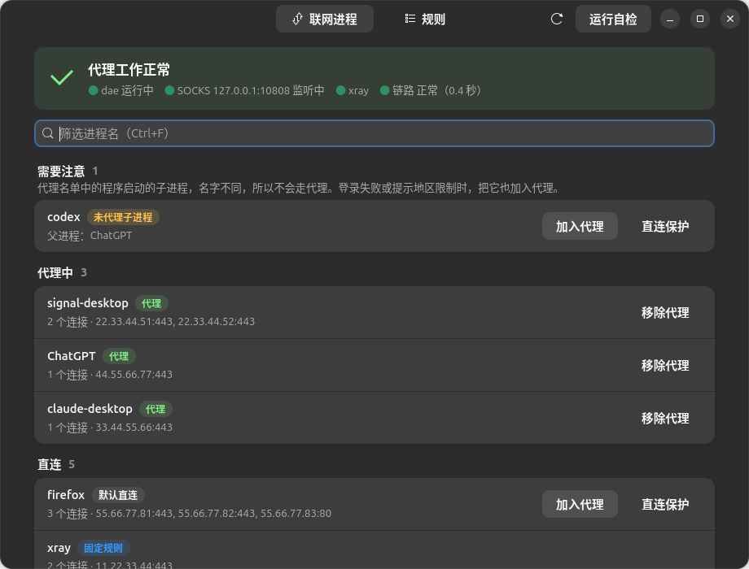

<div align="center">


# Proxyctl

**Linux 上的 Proxifier：只让你指定的程序走代理，其他一律直连。**

[](https://github.com/atmago/dae-proxyctl/releases)
[](LICENSE)


[安装教程](docs/INSTALL.md) · [使用手册](docs/MANUAL.md) · [版本记录](CHANGELOG.md)

</div>

<br>



<sub>截图中的进程和 IP 地址均为演示数据。</sub>

## 为什么需要它

在 Linux 上，**系统代理**很多程序不认（Signal、不少 Electron 应用、命令行工具）；
**TUN / 全局代理**又会把所有程序都送进代理，国内网站变慢，网银、公司 VPN 也可能出问题。

你真正想要的往往是：**只有 Signal、Claude、ChatGPT 这几个程序走代理**。
[dae](https://github.com/daeuniverse/dae) 能按进程名分流，但要手写配置，写错一个字符就启动失败。
Proxyctl 是 dae 的遥控器：点一下就能把程序加入代理，改配置、校验、生效、出错回滚都由它负责。

## 特性

<table>
<tr>
<td width="33%" valign="top">

**🔍 看得到**<br>
列出正在联网的程序和它们的进程名，每个程序走代理还是直连一目了然

</td>
<td width="33%" valign="top">

**👆 点一下**<br>
在图形界面里一键加入代理名单，dae 的配置由 Proxyctl 去改

</td>
<td width="33%" valign="top">

**🛡️ 改不坏**<br>
每次修改先备份、用 dae 校验，出错自动恢复原配置

</td>
</tr>
<tr>
<td valign="top">

**🔔 有提醒**<br>
dae 停了、代理断了、节点变慢时，弹出桌面通知

</td>
<td valign="top">

**🔀 有备用**<br>
dae 本身出问题时，把单个程序切到备用方案，直接连代理端口

</td>
<td valign="top">

**📈 看得清**<br>
链路延迟曲线、DNS 走向、端到端自检，出问题时知道是哪一环

</td>
</tr>
</table>

## 工作原理

```
你的程序（Signal、Claude……）
   │
   ▼
dae：按进程名判断每个连接
   ├─ 在代理名单里 ──▶ 代理客户端（v2rayN 等，127.0.0.1:10808）──▶ 节点 ──▶ 外网
   └─ 不在名单里   ──▶ 直连
```

代理客户端负责连节点，dae 负责分流，Proxyctl 只管理 dae 的名单，它自己不碰任何网络流量。

## 快速开始

> **第一次接触 dae 或 Linux 命令行？** 请直接看 👉 **[小白安装教程](docs/INSTALL.md)**，每一步都有详细说明。

已经装好 dae 并有能用的代理客户端（本机 SOCKS5 端口）时，只需要：

```bash
git clone https://github.com/atmago/dae-proxyctl.git && cd dae-proxyctl
sudo ./install.sh        # 安装，并在 dae 配置中加入 Proxyctl 管理的区块（改之前自动备份）
proxyctl test            # 端到端自检
proxyctl add signal-desktop
```

之后在应用列表里打开 **Proxyctl**，就可以用图形界面管理了。

## 文档

| 文档 | 内容 |
|---|---|
| 📘 [安装教程](docs/INSTALL.md) | 从零开始：准备代理客户端、安装 dae、写配置、安装 Proxyctl、加入第一个程序 |
| 📗 [使用手册](docs/MANUAL.md) | 日常使用、常见问题、出问题时怎么办、备用方案、全部命令和配置项 |
| 📝 [版本记录](CHANGELOG.md) | 每个版本改了什么 |
| 🧭 [设计决定](DECISIONS.md) | 边界情况的处理方式和原因（给开发者） |

## 适用环境

目前在 **Ubuntu（GNOME）+ dae + v2rayN** 上实际使用。其他发行版、桌面环境或代理核心（sing-box、mihomo）理论上可用，
欢迎[反馈问题](https://github.com/atmago/dae-proxyctl/issues)。界面和输出目前只有中文。

## 许可证

[MIT](LICENSE)
