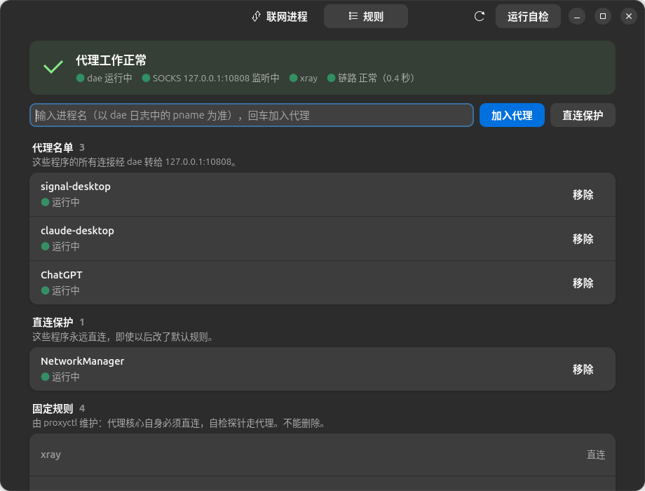

<div align="center">


# Proxyctl 安装教程

**从零开始，一步一步来。不需要懂网络，也不需要会编程。**

[← 返回首页](../README.md) · [使用手册](MANUAL.md)

</div>

---

## 目录

* [开始之前：先了解三件事](#开始之前先了解三件事)
* [第 0 步：确认电脑满足要求](#第-0-步确认电脑满足要求)
* [第 1 步：准备代理客户端（v2rayN）](#第-1-步准备代理客户端v2rayn)
* [第 2 步：安装 dae](#第-2-步安装-dae)
* [第 3 步：写 dae 配置文件](#第-3-步写-dae-配置文件)
* [第 4 步：启动 dae](#第-4-步启动-dae)
* [第 5 步：安装 Proxyctl](#第-5-步安装-proxyctl)
* [第 6 步：自检](#第-6-步自检)
* [第 7 步：把第一个程序加入代理](#第-7-步把第一个程序加入代理)
* [第 8 步：开机自启（可选）](#第-8-步开机自启可选)
* [装好了，接下来呢？](#装好了接下来呢)
* [装错了想撤销](#装错了想撤销)

---

## 开始之前：先了解三件事

### 1. 我们要装的三样东西

整个方案由三个软件配合完成，各管一件事：

| 软件 | 它负责什么 | 打个比方 |
|---|---|---|
| **v2rayN**（代理客户端） | 连接你的代理节点，在电脑上开一个“代理入口” | 通往外网的**隧道** |
| **dae** | 看每个网络连接是哪个程序发出的，决定走隧道还是直连 | 路口的**交警** |
| **Proxyctl** | 帮你告诉交警“哪些程序要走隧道”，不用手写配置 | 交警的**遥控器** |

所以安装顺序是：先有隧道（第 1 步），再请交警（第 2～4 步），最后装遥控器（第 5 步）。

### 2. 几个会反复出现的词

| 词 | 意思 |
|---|---|
| **终端** | 输入命令的黑色窗口。Ubuntu 里按 `Ctrl` + `Alt` + `T` 打开。 |
| **进程名** | 程序运行时在系统里的名字。例如 Signal 的进程名是 `signal-desktop`。dae 只认这个名字。 |
| **代理名单** | 要走代理的进程名列表。 |
| **SOCKS5 端口** | 代理客户端在电脑上开的“代理入口”，v2rayN 默认是 `10808`。 |

### 3. 怎么执行教程里的命令

教程里每个灰色代码框是**一条命令**。操作方法：

1. 点代码框右上角的复制按钮（或者选中文字后 `Ctrl` + `C`）；
2. 在终端里按 **`Ctrl` + `Shift` + `V`** 粘贴（注意终端里要多按一个 `Shift`）；
3. 按回车执行。

> [!NOTE]
> 命令开头有 `sudo` 时，终端会要求输入**你的登录密码**。输入时屏幕上**什么都不显示**，没有星号也没有圆点，这是正常的。
> 输完直接按回车即可。如果电脑配了指纹，也可能提示你按指纹。

> [!TIP]
> 看到一大段英文不要慌。**大多数时候只需要看最后几行**；教程在每一步都写了“成功的样子”，对照着看就行。

---

## 第 0 步：确认电脑满足要求

dae 对系统有两个要求。打开终端，依次执行下面两条命令。

**① 检查内核版本**（需要 5.17 或更高）：

```bash
uname -r
```

✅ **成功的样子**：显示类似 `6.8.0-45-generic`、`7.0.0-34-generic`，开头的数字大于等于 `5.17` 就行。
Ubuntu 24.04 及以后、Debian 12 及以后的默认内核都满足。

**② 检查内核是否支持 BTF**：

```bash
ls /sys/kernel/btf/vmlinux
```

✅ **成功的样子**：显示 `/sys/kernel/btf/vmlinux`。
❌ 如果显示 `没有那个文件或目录`，说明内核不支持，dae 无法运行，只能换一个较新的系统版本。

另外还需要：

- **一个能用的代理节点**（本教程不涉及节点从哪里来）；
- **Ubuntu、Debian、Linux Mint** 这类用 `apt` 装软件的系统（其他发行版也能用，但安装命令要自己换）。

---

## 第 1 步：准备代理客户端（v2rayN）

dae 自己不会连接节点，它要把流量交给电脑上的代理客户端。这里以 **v2rayN** 为例。

**1.1 安装 v2rayN 并导入节点。**
从 [v2rayN 的发布页](https://github.com/2dust/v2rayN/releases) 下载 Linux 版（文件名里带 `linux` 的 `.deb`），
双击安装。打开后导入你的节点，并选中一个节点。

**1.2 记下 SOCKS 端口。**
在 v2rayN 的“设置 → 参数设置”里找到“本地监听端口”（socks 端口），**记下这个数字**，默认是 `10808`。

> [!IMPORTANT]
> 如果你的端口**不是** `10808`，后面教程里所有出现 `10808` 的地方，都要换成你的端口。

**1.3 关闭“系统代理”和“TUN 模式”。**
在 v2rayN 主界面底部，把系统代理设为 **“清除系统代理”**，**TUN 开关保持关闭**。

> [!WARNING]
> 开着系统代理或 TUN，所有程序都会被代理，“只让指定程序走代理”就失去了意义，还会干扰 Proxyctl 的诊断。

**1.4 测试代理能不能用。** 在终端执行：

```bash
curl -x socks5h://127.0.0.1:10808 https://ifconfig.me/ip; echo
```

✅ **成功的样子**：显示一串数字，例如 `203.0.113.7`，这是**节点的 IP**。
可以对比一下：打开浏览器搜索“我的 IP”，看到的是你自己的 IP，两者应该不同。

❌ **如果失败**（报错或者等很久没反应）：在 v2rayN 里换一个节点，或者检查端口号有没有写错。
**这一步不通，后面都不会通**，一定要先解决。

<details>
<summary>用的是 Clash Verge、mihomo 或 sing-box 客户端？（点开查看）</summary>

找到它的 SOCKS 端口或“混合端口（mixed-port）”，后面把 `10808` 都换成它。

另外要记下它的**内核进程名**，第 3 步要用。代理客户端启动后执行（把 `7890` 换成你的端口）：

```bash
ss -ltnp | grep 7890
```

输出里 `users:(("xxx",...` 括号中的 `xxx` 就是进程名，例如 `verge-mihomo`。

</details>

---

## 第 2 步：安装 dae

dae 官方提供了软件源，但它在国内有时打不开，所以下面的命令都**经过第 1 步的代理下载**，
这样不管能不能直连都能装上。

**2.1 查看 apt 的版本：**

```bash
apt --version
```

会显示 `apt 2.x.x` 或 `apt 3.x.x`。按版本执行**其中一条**命令，添加 dae 的软件源：

<table>
<tr><th>显示 <code>apt 3.x</code>（Ubuntu 25.04 及以后、Debian 13 及以后）</th></tr>
<tr><td>

```bash
sudo curl -x socks5h://127.0.0.1:10808 -fsSL -o /etc/apt/sources.list.d/daeuniverse.sources https://daeuniverse.pages.dev/daeuniverse.sources
```

</td></tr>
<tr><th>显示 <code>apt 2.x</code>（Ubuntu 24.04、Debian 12 等）</th></tr>
<tr><td>

```bash
sudo curl -x socks5h://127.0.0.1:10808 -fsSL -o /etc/apt/sources.list.d/daeuniverse.list https://daeuniverse.pages.dev/daeuniverse.list
```

</td></tr>
</table>

✅ **成功的样子**：没有任何输出，直接回到可以输入命令的状态。

**2.2 导入软件源的签名密钥**（apt 用它确认下载的软件没有被篡改）：

```bash
sudo curl -x socks5h://127.0.0.1:10808 -fsSL -o /usr/share/keyrings/daeuniverse-archive-goose.gpg https://daeuniverse.pages.dev/daeuniverse-archive-goose.gpg
```

**2.3 更新软件列表，再安装 dae。** 命令中间的 `-o Acquire...` 是让 apt 也走代理：

```bash
sudo apt -o Acquire::http::Proxy=socks5h://127.0.0.1:10808 -o Acquire::https::Proxy=socks5h://127.0.0.1:10808 update
```

```bash
sudo apt -o Acquire::http::Proxy=socks5h://127.0.0.1:10808 -o Acquire::https::Proxy=socks5h://127.0.0.1:10808 install dae
```

安装过程中如果问 `是否继续？[Y/n]`，输入 `y` 回车。

**2.4 确认装好了：**

```bash
dae --version
```

✅ **成功的样子**：显示 `dae version v2.1.1` 这样的版本号。
（注意是 `dae --version`，写成 `dae version` 会报错。）

> [!NOTE]
> 安装时会顺带装上 `v2ray-rules-dat`（分流用的规则数据），这是正常的。
> 上面的命令来自 dae 官方的 [Linux 软件源说明](https://github.com/daeuniverse/repo-for-linux)，如有变化以官方为准。

---

## 第 3 步：写 dae 配置文件

dae 的配置文件是 `/etc/dae/config.dae`，我们要往里面写一份最简单的配置。

**3.1 打开编辑器。** `nano` 是终端里的简单文本编辑器：

```bash
sudo nano /etc/dae/config.dae
```

终端会变成一个编辑界面。如果里面已经有内容，先把它清空：按住 `Ctrl` + `K` 不放，直到内容全部删掉。

**3.2 粘贴下面的配置。** 复制整段内容，在 nano 里按 `Ctrl` + `Shift` + `V` 粘贴：

```
global {
    # 自动选择上网的网卡（有线 / Wi-Fi 都行）
    wan_interface: auto
    log_level: info
    auto_config_kernel_parameter: true
}

node {
    # 代理客户端提供的本地 SOCKS5 地址，按你的客户端修改端口
    local: 'socks5://127.0.0.1:10808'
}

group {
    proxy {
        filter: name(local)
        policy: fixed(0)
    }
}

routing {
    # 代理客户端的内核必须直连，否则会形成回环
    pname(xray) -> must_direct

    # 网络管理器保持直连
    pname(NetworkManager) -> must_direct

    # 其他所有程序默认直连
    fallback: direct
}
```

> [!IMPORTANT]
> 粘贴前检查两处要不要改：
> - 端口不是 10808 的，改掉 `127.0.0.1:10808` 这一处；
> - 代理客户端不是 v2rayN 的，把 `pname(xray)` 里的 `xray` 换成第 1 步查到的内核进程名。

**3.3 保存并退出：** 按 `Ctrl` + `O`，再按回车确认保存，最后按 `Ctrl` + `X` 退出。

<details>
<summary>这份配置是什么意思？（点开查看）</summary>

- `node` 段：告诉 dae，你的代理客户端在 `127.0.0.1:10808`；
- `group` 段：把它命名为 `proxy` 组；
- `routing` 段：规则从上往下看。代理客户端自己和网络管理器必须直连，其他所有程序默认直连。

也就是说，现在**还没有任何程序走代理**。之后往名单里加程序的事，交给 Proxyctl。

</details>

**3.4 设置文件权限。** dae 要求配置文件只有管理员能读，否则拒绝启动：

```bash
sudo chmod 600 /etc/dae/config.dae
```

**3.5 检查配置有没有写错：**

```bash
sudo dae validate -c /etc/dae/config.dae
```

✅ **成功的样子**：**没有任何输出**。

❌ **如果报错**：

| 报错里有 | 原因和办法 |
|---|---|
| `permissions 0644 ... are too open` | 权限没设好，重新执行一次 3.4 的命令 |
| 其他错误 | 多半是粘贴时少了括号或引号。回到 3.1 重新打开，清空后再粘贴一次 |

---

## 第 4 步：启动 dae

**4.1 启动：**

```bash
sudo systemctl start dae
```

**4.2 查看状态：**

```bash
systemctl status dae --no-pager
```

✅ **成功的样子**：能看到绿色的 **`active (running)`**。
这时打开几个网页试试，上网应该和之前完全一样，因为目前所有程序都是直连。

<details>
<summary>显示 <code>failed</code> 了？查看日志（点开查看）</summary>

```bash
sudo journalctl -u dae -n 30 --no-pager
```

最后几行会写明失败原因。正常启动时，日志里能看到类似这几行：

```
INFO Loading routing rules into kernel space (BPF)...
INFO Bind to WAN: wlp3s0
INFO Total startup time: 731.883537ms
```

`Bind to WAN:` 后面是你上网用的网卡（Wi-Fi 一般是 `wlp...`，有线一般是 `enp...`）。

</details>

> [!TIP]
> **不用担心 dae 把网络搞坏。** 随时执行 `sudo systemctl stop dae`，所有程序立刻恢复直连，不会留下任何设置。

---

## 第 5 步：安装 Proxyctl

**5.1 安装依赖。** 这些都来自系统自带的软件源，不需要代理：

```bash
sudo apt install git curl iproute2 python3-gi gir1.2-gtk-4.0 gir1.2-adw-1 libnotify-bin pkexec
```

<details>
<summary>这些都是什么？（点开查看）</summary>

- `git`：下载 Proxyctl；
- `python3-gi`、`gir1.2-gtk-4.0`、`gir1.2-adw-1`：图形界面；
- `libnotify-bin`：桌面通知；
- `pkexec`：在图形界面里弹出输入密码的授权框。

只用命令行的话，图形界面相关的几个缺了也能用。

</details>

**5.2 下载 Proxyctl。** 下面的命令会在你的**主文件夹**里创建一个 `dae-proxyctl` 文件夹。
访问 GitHub 可能不稳定，所以同样经过代理下载：

```bash
cd ~ && git -c http.proxy=socks5h://127.0.0.1:10808 clone https://github.com/atmago/dae-proxyctl.git
```

然后进入这个文件夹：

```bash
cd ~/dae-proxyctl
```

> [!TIP]
> 这个文件夹请**保留**，以后升级或卸载都要用到。

**5.3 运行安装脚本：**

```bash
sudo ./install.sh
```

✅ **成功的样子**：最后一行显示 **“安装完成”**。

<details>
<summary>安装脚本做了什么？（点开查看）</summary>

- 检查依赖，缺少必需的程序会直接停下，**不做任何修改**；
- 把 `proxyctl` 装到 `/usr/local/bin/`，并在应用列表里添加 Proxyctl 图标（搜索“代理”也能找到）；
- 从 dae 配置里自动识别你的 SOCKS5 端口，写入 `/etc/proxyctl.conf`；
- 在 dae 配置的 `routing { }` 开头加入 Proxyctl 管理的区块，把已有的程序规则搬进去（**改之前自动备份**）；
- 设置 dae 异常退出时自动重启；
- 安装一个每 15 秒运行一次的健康检查，出问题时弹出桌面通知。

脚本可以重复执行，不会产生重复内容。

</details>

---

## 第 6 步：自检

执行下面的命令，Proxyctl 会真正发几次请求，把整条链路检查一遍：

```bash
proxyctl test
```

✅ **成功的样子**（IP 为示例）：

```
dae 服务状态：active；SOCKS5 127.0.0.1:10808：监听中
[PASS] 1. 通过 SOCKS5 直接访问 https://ifconfig.me/ip，得到代理出口 IP：203.0.113.7
       说明代理客户端（v2rayN 等）与远程节点工作正常。
[PASS] 2. proxyctl-probe 得到 203.0.113.7，与代理出口一致
       说明 dae 按进程名把名单程序送进了代理。
[PASS] 3. proxyctl-direct 得到 198.51.100.8，与代理出口不同（默认直连正常）
[PASS] 4. 新建代理连接速度正常：中位 0.4 秒
       连续新开 5 条连接，耗时（秒）：0.4、0.4、0.5、0.4、0.4
结论：全部通过。
```

**前 3 项都是 PASS，就说明一切正常。**

| 这一项失败 | 说明哪里有问题 | 怎么办 |
|---|---|---|
| 第 1 项 | 代理客户端或节点 | 回到第 1 步，在 v2rayN 里换节点、检查端口 |
| 第 2 项 | dae 分流 | 确认 dae 在运行（第 4 步），按输出里的提示处理 |
| 第 3 项 | 所有程序都进了代理 | 多半是开着 v2rayN 的系统代理或 TUN，关掉（第 1.3 步） |
| 第 4、5 项 WARN | 节点较慢 / 开着 TUN | 只是提醒，不影响使用。详见[使用手册](MANUAL.md#常见问题) |

每一项失败时，输出里都会用中文写明原因和处理办法。

---

## 第 7 步：把第一个程序加入代理

以 Signal 为例，其他程序同理。

### 方法一：用图形界面（推荐）

1. 先**打开 Signal**，让它联网一下（登录、刷新都行）；
2. 在应用列表里打开 **Proxyctl**；
3. 在 **“联网进程”** 页找到 `signal-desktop`，点 **“加入代理”**，输入密码授权；
4. 底部提示成功后，Signal 会在几十秒内自动重连，之后就走代理了。

“规则”页可以查看和管理名单，也可以直接输入进程名添加：



### 方法二：用命令行

先看看有哪些程序在联网、它们叫什么：

```bash
proxyctl list
```

找到要代理的那个，把它的进程名加入名单：

```bash
proxyctl add signal-desktop
```

也可以用 `proxyctl pick`：列出程序后直接输入编号加入。

### 常见疑问

<details>
<summary>在列表里找不到我要的程序？</summary>

**进程名不一定是程序的名字。** 桌面图标上写的是“Signal”，进程名却是 `signal-desktop`。
打开程序后，可以用下面的命令查（把 `signal` 换成程序名里的关键词）：

```bash
ps -eo pid,comm,args | grep -i signal | grep -v grep
```

第二列（`comm`）就是进程名。Signal 这类程序会有很多个进程，但名字通常都一样，加一个就够了。

</details>

<details>
<summary>加入后还是连不上，或者提示“地区不支持”？</summary>

很多程序真正联网的是**名字不同的子进程**。例如 ChatGPT 桌面版的登录由子进程 `codex` 完成，只加入 `ChatGPT` 会被提示地区不支持。
Proxyctl 会把这类进程显示为 **“未代理子进程”**，把它也加入即可。

</details>

<details>
<summary>Signal 这种“代理不可用时绝不能启动”的程序怎么办？</summary>

可以加一个**启动守卫**：dae 或代理没准备好时，点图标会拒绝启动并弹出提示，防止它直连。执行（**不要**加 sudo）：

```bash
proxyctl guard-desktop signal-desktop.desktop
```

</details>

---

## 第 8 步：开机自启（可选）

安装脚本**不会**替你设置 dae 开机自启，要不要自启由你决定。
建议先用几天，把常用的程序都加进名单、确认都正常后再开启：

```bash
sudo systemctl enable dae
```

代理客户端也要设成登录后自动启动（v2rayN 在设置里勾选“开机启动”）。

> [!WARNING]
> **dae 没有运行时，名单里的程序会直接连外网。** 设置开机自启，再配合启动守卫和健康检查通知，就能避免这种情况。
> 开机时 dae 会比 v2rayN 先启动，这段时间名单里的程序会连不上（不会泄露），登录、v2rayN 启动后自动恢复。

---

## 装好了，接下来呢？

🎉 恭喜，安装完成！以后大部分时候只需要打开图形界面 **Proxyctl**：

- **顶部状态卡**一句话告诉你代理是否正常，出问题时变色并给出处理建议；
- **联网进程**页一键加入或移除代理；
- **规则**页管理名单；dae 出问题时，也在这里把单个程序切到**备用方案**。

更多用法、常见问题和出问题时的处理办法，请看 👉 **[使用手册](MANUAL.md)**。

---

## 装错了想撤销

- **只是想暂时关掉**：`sudo systemctl stop dae`，所有程序立刻恢复直连。
- **恢复安装前的 dae 配置**：`sudo proxyctl backups` 找到最早的 `*-init.dae`，然后 `sudo proxyctl restore <它的名字>`。
- **卸载 Proxyctl、甚至连 dae 一起卸载**：见使用手册的 [卸载](MANUAL.md#卸载) 一节。
