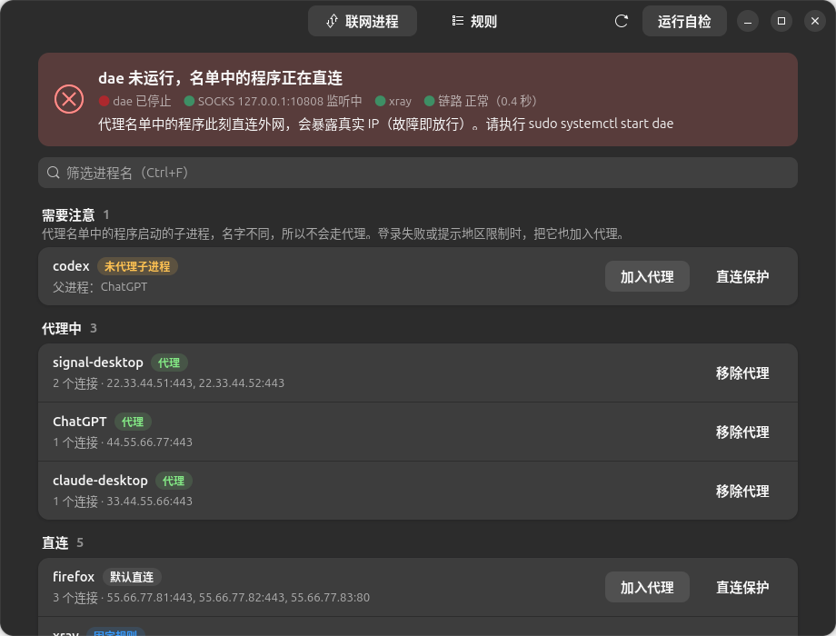

<div align="center">


# Proxyctl 使用手册

**日常使用、常见问题、出问题时怎么办，以及全部命令和配置项。**

[← 返回首页](../README.md) · [安装教程](INSTALL.md)

</div>

---

## 目录

* [日常使用](#日常使用)
* [出问题时会怎样（故障模式）](#出问题时会怎样故障模式)
  * [dae 出问题时：把单个程序切到备用方案](#dae-出问题时把单个程序切到备用方案)
* [常见问题](#常见问题)
* [参考手册](#参考手册)（配置结构、全部命令、配置项、检查项）
* [卸载](#卸载)
* [开发与测试](#开发与测试)

---

## 日常使用

大部分时候只需要打开图形界面 **Proxyctl**：

* **顶部状态卡**：一句话告诉你代理是否正常，出问题时变色并给出处理建议；
* **联网进程页**：按“需要注意 / 代理中 / 直连 / 最近断开”分组，一键加入代理、直连保护或移除，`Ctrl` + `F` 搜索；
* **规则页**：查看和管理代理名单、直连保护名单，也可以手动输入进程名添加；
  每个代理程序旁边显示它当前走 dae 还是备用方案，dae 出问题时点 **备用** 切换；
* **延迟页**：过去 6 小时 / 24 小时 / 7 天里每次新建代理连接的耗时曲线，底部色带标出当时用的是哪个内核，
  下方列出异常时段（连续失败或超过 3 秒）和内核切换，鼠标悬停可看每个点的时间和耗时；
* **左上角**：软件图标；
* **右上角**：运行自检；菜单里可以导入 / 导出规则，“关于 Proxyctl”显示版本号、作者和 GitHub 地址。

常用命令：

| 想做的事 | 命令 |
|---|---|
| 看哪些程序在联网、走的是哪条路 | `proxyctl list` |
| 把程序加入代理 | `proxyctl add <进程名>` 或 `proxyctl pick` |
| 把程序移出代理 | `proxyctl remove <进程名>` |
| 查看当前名单 | `proxyctl rules` |
| 代理好像不通了 | `proxyctl test`，然后 `sudo proxyctl check` |
| 最近是不是节点变慢了、从什么时候开始的 | `proxyctl history`（GUI：延迟页） |
| 改坏了想恢复 | `sudo proxyctl backups`，然后 `sudo proxyctl restore <备份名>` |
| 想知道代理程序的 DNS 怎么走 | `proxyctl dns`（GUI：DNS 页） |
| 不想让运营商看到代理程序查询的域名 | `sudo proxyctl dns --protect on`（GUI：DNS 页 → DNS 防泄漏 → 开启） |
| 某个程序经 dae 总是断线，但节点正常 | `proxyctl fallback on <进程名>`（GUI：规则页 → 备用），见[备用方案](#dae-出问题时把单个程序切到备用方案) |
| 把规则搬到另一台电脑 | 旧电脑 `proxyctl export 规则.json`，新电脑 `sudo proxyctl import 规则.json`（GUI：右上角菜单 → 导入规则 / 导出规则） |

**每次修改名单，dae 都会重新加载，正在走代理的连接会断开一下**，程序一般会自动重连；Signal 重连较慢，可能要 1～2 分钟。

## 出问题时会怎样（故障模式）

出问题时，图形界面顶部的状态卡会变色，并直接告诉你该怎么处理。例如 dae 没有运行时：



| 情况 | 结果 | 说明 |
|---|---|---|
| **dae 停止**（崩溃、被停止、开机未启动） | **故障即放行** | 没有任何进程被拦截，名单中的程序会**直接连接外网**，暴露真实 IP。check 会报 FAIL，定时器最迟约 15 秒内弹通知、恢复时再通知；`proxyctl run` / guard-desktop 会阻止被守卫的程序启动（但无法影响已在运行的程序）。 |
| **xray / v2rayN 停止**，或节点不可用 | **故障即断开** | dae 仍然把名单程序送进 proxy 组，但 SOCKS5 不通，这些程序无法联网，不会泄露。xray 在运行但连不上节点时，链路探测会在约 2～3 分钟内报警。 |
| 新配置未通过 validate | 不生效 | 原配置不变。 |
| reload 失败，或 reload 后 dae 退出 | 自动回滚 | 恢复原配置并再次 reload；若 dae 仍未恢复，会提示 `sudo systemctl restart dae`。drop-in 的 `Restart=on-failure` 也会让 systemd 尝试重启 dae。 |
| 节点很慢（高峰期拥堵、线路限速） | 能用但很卡 | 经代理每个新连接要好几秒。Claude 这类一次性请求还能用，Signal 这类长连接会反复显示离线。链路探测连续 3 次超过 3 秒会提醒“代理很慢”，在 v2rayN 中更换节点即可。 |
| 修改名单（add / remove / protect / unprotect / restore） | 短暂断线 | dae 重新加载会断开所有正在走代理的连接，程序会自动重连；Signal 重连较慢，可能离线几十秒到 1～2 分钟。命令输出和 GUI 对话框会提示这一点。 |
| 应用改名 / 同名程序 | 规则按名字匹配 | pname 只看进程名，改名即可绕过；同名的其他程序也会被代理。这是 dae pname 的固有性质。 |
| **dae 自身出 bug**（例如某个程序的连接频繁被重置，而节点正常） | 部分程序不稳定 | 把受影响的程序切到备用方案，见下一节。 |

### dae 出问题时：把单个程序切到备用方案

dae 只负责“把程序的流量交给代理端口”。如果是 dae 这一层出了问题（例如 dae 2.1.1 的 netkit 模式下，
Claude Code 连 api.anthropic.com 频繁出现 `Request failed · Retrying`），可以让**这一个程序**自己直连代理端口，
不经过 dae；其他程序照常走 dae。

```bash
proxyctl fallback status              # 每个程序现在走哪条路（按实际连接统计）
proxyctl fallback on claude           # 切到备用方案
proxyctl fallback off claude          # 改回经 dae
proxyctl fallback on --all            # 名单中的程序全部切换
```

也可以在图形界面“规则”页，点代理名单中某一行的 **备用** / **改回 dae**。

- **不需要 root，不改 dae 配置，不 reload dae**。dae 继续运行，名单中的规则保留作兜底。
- **桌面程序**（Signal、Claude Desktop、ChatGPT 等）：Proxyctl 生成一个启动器，启动时给程序加上代理设置。
  **需要完全退出程序（包括托盘图标）再重新打开**才会生效；从终端直接运行程序不会经过这个启动器。
- **Claude Code**（进程名 `claude`）：改的是 `~/.claude/settings.json`，新开的会话生效，不用重启 Claude Desktop。
- **子进程**（如 ChatGPT 启动的 codex）没有自己的启动器，对上层程序开启即可，子进程会继承代理设置。
- 代理端口（v2rayN）不可用时，切到备用的程序会连不上，**不会退回直连**。
- 如果是节点慢或不通，切到备用也没用（两条路用的是同一个节点），请在 v2rayN 中更换节点。

## 常见问题

**加入名单后应用还是直连？**
先 `proxyctl test` 看链路是否正常，再 `sudo journalctl -u dae -f` 看该应用实际的 pname。
很多应用真正联网的是子进程（例如 `xxx-helper`、`WebKitNetworkProcess`），要加入的是子进程的名字。
另外已经建立的长连接不会被重新分流，重启应用即可。

**为什么不能 add python3 / node / java / curl？**
dae 只按名字匹配，加入 `python3` 会把电脑上所有 Python 程序（例如量化交易程序）一起送进代理。
这类程序请在程序自己的设置里配置 SOCKS5 代理，或者设置环境变量，例如 `ALL_PROXY=socks5h://127.0.0.1:10808`。
完整列表见[进程名规则](#进程名规则)。（init 时如果旧配置里已有这类名字，会原样迁移并给出警告，建议 `proxyctl remove`。）

**非 root 时 list / rules 显示“未知”或“来自缓存”？**
`/etc/dae/config.dae` 必须是 0600/0640，普通用户读不到。Proxyctl 每次以 root 修改或检查配置时，
会把名单（只有进程名）写入 `/var/lib/proxyctl/rules.json`（0644），非 root 命令和 GUI 读取这个缓存。
另外非 root 时 ss 只能看到当前用户自己的进程。

**重启后名单程序都连不上？**
先运行 `proxyctl test`（**不要先开 v2rayN 的 TUN 模式**：TUN 与 dae 同时开会互相叠加，名单被绕过，诊断也会被干扰）。
第 1 步就 FAIL 说明 xray 连不上节点，在 v2rayN 中测试或更换节点；第 1 步 PASS、第 2 步 FAIL 才是 dae 的问题。
开机时 dae 会比 v2rayN（登录后自启）早启动，这段时间名单程序连不上是正常的（故障即断开），登录后会自动恢复。

**Signal 显示离线，但 `proxyctl test` 全部通过？**
先看是不是节点太慢：`proxyctl check --basic` 或 GUI 顶栏的“链路”会显示每次探测的耗时，正常应在 1 秒左右。
如果要好几秒，在 v2rayN 中测试延迟并更换节点，然后从托盘退出 Signal 再重新打开。
刚修改过名单、刚重启过 v2rayN 或 dae 时，Signal 也会离线一会儿，等 1～2 分钟或重开 Signal 即可。

**Claude 反复显示 "Request failed · Retrying"，但 v2rayN 里节点延迟只有几百毫秒？**
看 `proxyctl test` 的第 4 项：它连续新开 5 条代理连接并计时，中位超过 1.5 秒（`connect_slow`）就给出 WARN。
v2rayN 的延迟测试反映的是已建好连接上的一次请求，“新建连接很慢”时它照样显示几百毫秒，浏览网页也感觉不到；
但 Claude 这类频繁新开连接的应用会反复超时。解决办法：在 v2rayN 中双击当前节点，开启“Mux 多路复用”，再点“重启服务”
（v2rayN 7.x 的 Mux 开关跟着节点走，换节点后要重新开；设置页里的“sing-box Mux 协议”对 xray 内核无效）。
第 5 项检测到 TUN 网卡时也会给出 WARN，请关闭 v2rayN 的 TUN 模式。警告不影响 test 的退出码。

**我的代理客户端端口不是 10808，要改哪里？**
两处要一致：dae 配置里 `node` 段的 socks5 地址，以及 `/etc/proxyctl.conf` 里的 `socks = `（安装时会自动识别，一般不用手改）。
`sudo proxyctl check` 发现两者不一致时会给出警告。

**IPv6？**
如果 check 提示有全局 IPv6 地址，请用 `/usr/local/lib/proxyctl/proxyctl-probe -6 -sS https://ifconfig.me/ip`
单独测试 IPv6 流量是否也走了代理。

**DNS 会泄露吗？**
默认会：应用把域名交给 systemd-resolved，由它以明文发给路由器，运营商能看到查询了哪些域名（连接本身仍走代理）。
`proxyctl dns` 和 GUI 的 DNS 页会显示每个程序实际的 DNS 走向。

所有程序的 DNS 都由 systemd-resolved 统一代发，dae 分不出是替哪个程序查的，所以无法只让代理程序的 DNS 走代理，
只能按域名区分。`sudo proxyctl dns --protect on`（DNS 防泄漏）会：

* 在配置末尾加入带标记的 `dns` 区块：局域网、反向解析和国内域名（`geosite:private`、`geosite:cn`、`.lan`）照旧交给原来的 DNS，
  其余域名交给 dae 查询 8.8.8.8；
* 在 routing 的代理名单区块之后加入带标记的 `dip(8.8.8.8) -> proxy`，让这些查询经代理发出，运营商只能看到加密的代理流量。

代价：对全系统生效（直连程序查询国外域名也经代理，首次约慢 0.4 秒）；代理不可用时国外域名暂时解析失败；
直连访问国外网站时拿到的地址按代理出口的位置分配。需要 `/usr/share/dae/geosite.dat`。
如果配置里已经有你自己写的 `dns` 区块，Proxyctl 拒绝开启，不改动你的 DNS 设置。
`sudo proxyctl dns --protect off` 删除这两处，配置恢复原样。开启和关闭都走同样的备份 / validate / reload / 回滚流程。

注意不要把 dae 的 `dial_mode: domain` 简单等同于 Proxifier 的“远程 DNS”，两者机制并不相同，对 DNS 有严格要求时请单独测试。

**如何回到安装前的配置？**
`sudo proxyctl backups` 找到最早的 `*-init.dae`，然后 `sudo proxyctl restore <它>`。

## 参考手册

### 配置结构

Proxyctl 只编辑 `/etc/dae/config.dae` 里 `routing { }` 开头的三个管理区块。dae 的 routing 规则**从上到下，首条命中生效**，
所以三个区块放在 routing 最前面，顺序固定为：安全区块 → 直连保护 → 代理名单。

```
routing {
    # >>> proxyctl:safety (do not edit) >>>
    pname(xray) -> must_direct          # 代理核心必须直连，否则形成回环
    pname(sing-box) -> must_direct
    pname(mihomo) -> must_direct
    pname(proxyctl-probe) -> proxy      # proxyctl test 使用的探针
    # <<< proxyctl:safety <
    # >>> proxyctl:direct >>>
    pname(NetworkManager) -> must_direct
    # <<< proxyctl:direct <
    # >>> proxyctl:proxy >>>
    pname(signal-desktop) -> proxy
    # <<< proxyctl:proxy <

    # 其他所有程序默认直连
    fallback: direct
}
```

管理区块之外的所有内容（global、node、group、dns、其他 routing 规则、注释、空行）
Proxyctl 都逐字节原样保留（唯一的例外是你主动开启 DNS 防泄漏时加入的两个带标记区域）。请不要手工编辑管理区块内部；如果标记被破坏，Proxyctl 会拒绝修改。

如果你的代理核心进程名不在安全区块里（例如某些客户端把 mihomo 改名为 `verge-mihomo`），
用 `proxyctl protect <进程名>` 把它加入直连保护。

### 每次写配置都是一个事务

1. 加文件锁（`/var/lib/proxyctl/lock`），防止两个 Proxyctl 同时修改；
2. 备份原配置到 `/var/lib/proxyctl/backups/`（保留最近 30 份）；
3. 在 `/etc/dae/` 下生成临时文件（root:root，0600）；
4. `dae validate -c 临时文件`，不通过就放弃，原配置不动；
5. 原子 `rename` 替换 `/etc/dae/config.dae`；
6. 若 dae 正在运行，`systemctl reload dae`，然后确认 `systemctl is-active dae` 仍是 active；
7. 任何一步失败都自动恢复原配置（如果已经 reload，会再 reload 一次），并给出中文说明。

### install.sh 安装了什么

* 检查依赖：python3、dae、curl、ss、systemctl（必需）；notify-send、pkexec、PyGObject（可选，缺少只警告）；
* 安装 `/usr/local/bin/proxyctl`；把 curl 复制为 `/usr/local/lib/proxyctl/proxyctl-probe` 和 `proxyctl-direct`；
* 创建 `/var/lib/proxyctl/backups`（0700）；
* 创建配置文件 `/etc/proxyctl.conf`（已存在则不动），并从 dae 配置中识别 SOCKS5 节点地址填入；
* 安装图形界面启动器 `/usr/share/applications/proxyctl.desktop`；
* 创建 systemd drop-in `/etc/systemd/system/dae.service.d/proxyctl.conf`（`Restart=on-failure`）并 `daemon-reload`，
  不改动 `/usr/lib` 下的原服务文件；
* 为当前登录用户（`SUDO_USER`）安装 systemd 用户定时器 `proxyctl-check.timer`：每 15 秒执行
  `proxyctl check --quiet --notify --basic`，dae 或代理端口出问题时弹出桌面通知（同一故障 10 分钟内只提醒一次），
  恢复正常时再弹一条“已恢复”通知；
* 执行 `proxyctl init`。

### 配置文件 /etc/proxyctl.conf

Proxyctl 的设置写在 `/etc/proxyctl.conf`（`键 = 值`，`#` 开头为注释），修改后立即生效，GUI 和健康检查定时器也会读取。
最常需要改的是 **SOCKS5 地址**：Proxyctl 用它检查代理端口、探测链路和做 `test`，必须与 dae 配置中的 socks5 节点一致。

```ini
# v2rayN 默认 127.0.0.1:10808；Clash / mihomo 常见 127.0.0.1:7891
socks = 127.0.0.1:7891
```

| 键 | 默认值 | 说明 |
|---|---|---|
| `socks` | `127.0.0.1:10808` | 代理核心的本地 SOCKS5 地址 |
| `config` | `/etc/dae/config.dae` | dae 配置文件 |
| `service` | `dae` | dae 的 systemd 服务名 |
| `iface` | （空） | 除默认路由接口外，额外检查全局 IPv6 的接口，逗号分隔 |
| `test_url` | `https://ifconfig.me/ip` | `test` 获取出口 IP 的地址 |
| `probe_url` | `https://www.gstatic.com/generate_204` | 链路探测地址 |
| `chain_interval` | `120` | 链路正常时每隔多少秒真正探测一次 |
| `slow_seconds` | `3` | 单次链路探测超过多少秒算慢 |
| `connect_slow` | `1.5` | `test` 中新建代理连接中位耗时的警告阈值（秒） |
| `test_retries` | `3` | `test` 中每个请求最多尝试几次 |
| `gui_recent` | `300` | GUI 保留最近断开进程的秒数 |
| `fallback_proxy` | `http://<socks>` | 备用方案中程序直接使用的代理地址（v2rayN 的端口同时支持 socks 和 http） |

同名环境变量 `PROXYCTL_<大写键名>`（例如 `PROXYCTL_SOCKS`）优先于配置文件，但 sudo、pkexec 和 systemd 定时器不会传递环境变量，
日常使用请改配置文件。配置文件必须属于 root 且不能被其他用户写入，否则会被忽略。

### 全部命令

需要 root 的命令（init、add、remove、protect、unprotect、restore、import）在终端里以普通用户运行时，
会自动通过 sudo 重新执行自身；在图形界面里则通过 pkexec 弹出授权框。

| 命令 | 说明 |
|---|---|
| `proxyctl init` | 创建管理区块并迁移已有的 `pname(X) -> proxy` / `-> must_direct` 规则。幂等；已初始化时只检查并修复安全区块。 |
| `proxyctl add <名称>` | 加入代理名单。会校验名称、拒绝通用运行时名称、检查与直连保护的冲突和重复；没有同名进程在运行时只警告。 |
| `proxyctl remove <名称>` | 从代理名单移除。 |
| `proxyctl protect <名称>` | 加入直连保护（`must_direct`）。通用运行时名称可以加入这里，因为直连是安全方向。 |
| `proxyctl unprotect <名称>` | 从直连保护移除。安全区块中的规则不能移除。 |
| `proxyctl rules` | 显示三个区块，以及 routing 中不受 Proxyctl 管理的规则。 |
| `proxyctl list` | 列出正在连接外网的进程（排除回环和局域网），按进程名聚合，显示 PID 数、连接数、远端示例、状态（代理 / 直连保护 / 默认直连 / 未代理子进程）和 DNS 走向（直连或代理、明文或加密；代理程序的 DNS 明文直连时标黄）。GUI 的“联网进程”页在状态旁显示同样的 DNS 标签，悬停可看完整路径。 |
| `proxyctl pick` | `list` 的交互版：输入编号，确认后执行 add。 |
| `proxyctl check [--quiet] [--notify] [--basic]` | 只读健康检查，每项输出 OK / WARN / FAIL。退出码：0 全部正常，1 有 WARN，2 有 FAIL。 |
| `proxyctl test` | 端到端自检（见下文）。 |
| `proxyctl run [--wait N] -- <命令...>` | 启动守卫：确认 dae active 且 SOCKS 端口在监听后才启动程序，否则弹通知并拒绝启动。 |
| `proxyctl fallback on\|off <名称...> [--all]` | 备用方案：让单个程序绕过 dae、直接连代理端口（见“dae 出问题时”）。不需要 root，不要加 sudo。 |
| `proxyctl fallback status [名称...]` | 各程序当前走 dae 还是备用方案：切换方式、连代理端口 / 经 dae 的连接数、是否需要重启才生效。 |
| `proxyctl run --fallback [--wait N] -- <命令...>` | 备用启动器使用：只要求代理端口在监听，给程序注入代理环境变量，Electron / Chromium 程序另加 `--proxy-server`。 |
| `proxyctl guard-desktop <x.desktop> [--undo]` | 在 `~/.local/share/applications/` 生成启动器覆盖副本，让它经 `proxyctl run --wait 30 --` 启动。不需要 root，不要加 sudo。 |
| `proxyctl dns [名称]` | 显示代理名单中程序的 DNS 走向：域名解析请求交给谁、是否被 dae 接管、经直连还是代理发往哪个上游、是否加密、谁能看到访问的域名、本地 DNS 污染会不会影响连接。走向相同的程序合并显示；指定名称时可以查看任意进程。GUI 中是“DNS”页。 |
| `proxyctl dns --protect on\|off` | DNS 防泄漏开关（需要 root，见“DNS 会泄露吗？”）。 |
| `proxyctl export [文件]` | 把代理名单和直连保护名单导出为 JSON（省略文件名时输出到终端）。只含进程名，不含节点、订阅等信息，可以放心拷到另一台机器或分享给别人。不需要 root。 |
| `proxyctl import <文件> [--replace]` | 导入 `export` 生成的文件。默认**合并**：只新增，不删除现有条目；加 `--replace` 则让规则与文件完全一致。文件中任何一个名字不合法就整体拒绝；通用运行时名称（如 curl、python3）、安全区块中的名字、与现有规则冲突的名字（合并时）会被跳过并说明原因。同样经过备份 / validate / reload / 回滚流程。 |
| `proxyctl history [--hours N]` | 代理链路延迟记录：最近 N 小时（默认 24，最多 168）的探测次数、中位 / 90 分位 / 最慢耗时、每小时统计、异常时段和内核切换。数据由健康检查定时器写入 `~/.local/state/proxyctl/chain-history.jsonl`，保留 7 天。GUI 中是“延迟”页。不需要 root。 |
| `proxyctl backups` | 列出配置备份。 |
| `proxyctl restore <备份名>` | 恢复备份（同样经过 validate / reload / 回滚流程）。 |
| `proxyctl gui` | 启动图形界面。所有修改通过 pkexec 授权执行，成功后底部弹出提示，失败才弹窗。安装了 libadwaita（gir1.2-adw-1）时界面跟随系统深浅色和强调色。 |

### 进程名规则

* 只允许 `A-Z a-z 0-9 . _ + -`，长度 1–64（防止注入 dae 配置语法）。
* Linux 内核里的进程名最多 15 个字符，超过的会被截断；Proxyctl 会对超过 15 个字符的名字给出警告。
* **以 dae 日志中实际显示的进程名为准**：`journalctl -u dae -f` 里的 `pname`。
* 以下通用运行时名称**不能**加入代理名单：python、python3、python3.*、node、nodejs、java、electron、
  bash、sh、zsh、fish、dash、perl、ruby、php、dotnet、mono、wine、wine64、wineserver、systemd、sudo、
  ssh、curl、wget、git。因为 pname 只按名字匹配，加入 python3 会把所有 Python 程序（例如量化交易程序）
  一起送进代理。这类程序请使用它自身的代理设置，例如 `ALL_PROXY=socks5h://127.0.0.1:10808`（换成你的 SOCKS 地址）。

### 添加新应用的完整流程

1. 打开应用，让它联网（例如登录、刷新一下）。
2. 执行 `proxyctl list`（或在 GUI 的“联网进程”标签页）找到它的进程名。
   Electron / Chromium 类应用可能有多个进程，名字不一定和启动命令相同。
   加入后再看一次 `list`：如果出现该应用的“未代理子进程”，而应用仍有地区限制或连不上，把子进程也加入。
3. `proxyctl add <进程名>`（或 `proxyctl pick`，或在 GUI 里点“加入代理”）。
4. 用 `sudo journalctl -u dae -f` 观察这个应用的连接，确认 `pname` 与名单一致、出口是 proxy。
   如果日志里显示的名字不同，`proxyctl remove` 旧名字，再 `add` 日志中的名字。
5. 对于“代理不可用时绝不能启动”的应用（例如 Signal：在无代理时启动可能导致设备被解除关联），加启动守卫：
   `proxyctl guard-desktop signal-desktop.desktop`。

### 未代理子进程

pname 只按进程名匹配。代理名单中的程序如果启动了**名字不同**的子进程，子进程不会自动走代理。
例如 ChatGPT 桌面版的登录由子进程 `codex` 完成：只加入 `ChatGPT` 时，登录会因为直连而报
`403 Country, region, or territory not supported`。

这类子进程往往只在登录、同步、检查更新时联网一两秒，`ss` 快照很难抓到。因此 `list` / `pick` / GUI
会直接从进程树中找出“代理名单程序的子孙进程中，名字不同且不在任何名单里的进程”，状态显示为
**未代理子进程**（即使它此刻没有任何连接），可以直接选中加入。
通用运行时名称（bash、python3 等）不能加入代理名单，所以不会列出；列出的进程也不一定需要联网，
只在该应用出现地区限制或连接失败时再加入即可。

GUI 的“联网进程”表还会把最近 5 分钟内出现过外网连接、现已断开的进程以灰色保留（`gui_recent` 秒数可调），
便于发现一闪而过的短连接。

### check 检查项

* dae 服务是否 active（未运行时用醒目的 FAIL 提示：名单中的程序此刻会直连外网）；
* SOCKS5 端口（默认 127.0.0.1:10808）是否在监听、由哪个进程监听；xray / sing-box / mihomo 是否在运行；
* **代理链路**：真正经 SOCKS5 访问一次 `https://www.gstatic.com/generate_204`（超时 15 秒），
  确认 xray → 节点 → 外网整条链路可用。dae、端口、xray 都正常但节点不通时，只有这一项能发现。
  连续 2 次失败才报 FAIL（节点偶发抖动只报 WARN）；连续 3 次都能通但每次超过 3 秒（`slow_seconds`），
  报 WARN“代理链路很慢”并弹一条普通通知（30 分钟内只提醒一次）——节点很慢时 Signal 会反复显示离线，
  而其他检查全部正常；
* 配置文件权限（root 所有、0600/0640）、能否读取、是否通过 `dae validate`、安全区块是否完整；
* 代理名单中是否有通用运行时名称、是否有超过 15 个字符的名字；
* dae 服务的 Restart 策略（不是 on-failure 时提示）；
* 默认路由接口（以及配置项 `iface` 中的接口）是否有全局 IPv6 地址（有则提醒单独测试 IPv6）；
* Proxyctl 的 SOCKS 地址是否与 dae 配置中的 socks5 节点一致；
* 当前 dial_mode、DNS 防泄漏是否开启、是否存在 systemd-resolve 的 must_direct 规则（仅展示）。

非 root 运行时读不到配置，这些项会显示为 SKIP，并提示用 `sudo proxyctl check` 获得完整检查。
`--quiet` 只输出 WARN/FAIL；`--notify` 在有 FAIL 时调用 notify-send；`--basic` 只检查 dae、端口、代理核心和代理链路。
定时器每 15 秒运行一次 `--basic`：链路正常时每 2 分钟才真正探测一次（`chain_interval`），
探测失败后每 15 秒复查，以便尽快确认故障或恢复。GUI 顶栏的“链路”指示灯读取定时器的结果，自己不发请求。

每次真正发出的链路探测都会记下时间、是否成功、耗时和当时监听 SOCKS 端口的进程（xray / sing-box / mihomo），
追加到 `~/.local/state/proxyctl/chain-history.jsonl`（重启后仍在，只保留最近 7 天，一般不超过几百 KB）。
`proxyctl history` 和 GUI 的延迟页读取这份记录。以 root 运行 check 时不记录。

### test 自检

1. `curl -x socks5h://<SOCKS 地址> https://ifconfig.me/ip` → 得到代理出口 IP；
2. 运行 `proxyctl-probe`（curl 副本，进程名命中安全区块里的 proxy 规则），不设任何代理 → 应等于代理 IP；
3. 运行 `proxyctl-direct`（curl 副本，不在任何规则中）→ 应不等于代理 IP（默认直连）；
4. 连续新开 5 条代理连接并计时，中位超过 `connect_slow` 秒给出 WARN；
5. 检测 TUN 网卡，存在时给出 WARN。

所有请求都带 `--max-time 10`，并清除 `*_proxy` 环境变量。每个请求失败时最多尝试 3 次（`test_retries`），
避免节点偶发抖动造成误报；重试后才成功时会注明“第 N 次尝试才成功”。如果经常看到这句提示，说明节点不稳定。
第 4、5 项的警告不影响退出码。

## 卸载

**只卸载 Proxyctl：** 先进入安装时下载的文件夹（按安装教程操作的话是 `~/dae-proxyctl`），再运行卸载脚本：

```bash
cd ~/dae-proxyctl
```

```bash
sudo ./uninstall.sh
```

如果切换过备用方案，先执行 `proxyctl fallback off --all` 恢复原来的启动器。

卸载不会删除管理区块里的规则，也不会删除备份，dae 会继续按现有名单分流。
如需还原配置，在卸载前执行 `sudo proxyctl restore <备份名>`（最早的 `*-init.dae` 就是 init 之前的原始配置）。

**连 dae 一起卸载：**

```bash
sudo systemctl disable --now dae
```

```bash
sudo apt remove dae
```

停止 dae 后，所有程序都恢复直连。

## 开发与测试

```bash
python3 -m unittest
```

测试全程不需要 root：用环境变量把配置、状态目录和外部程序换成假的：
`PROXYCTL_CONF`、`PROXYCTL_CONFIG`、`PROXYCTL_DAE_BIN`、`PROXYCTL_SYSTEMCTL`、`PROXYCTL_STATE_DIR`、`PROXYCTL_SOCKS`，
以及 `PROXYCTL_SS`、`PROXYCTL_CURL`、`PROXYCTL_LIBDIR`、`PROXYCTL_NOTIFY_SEND`、`PROXYCTL_PKEXEC`、
`PROXYCTL_SELF`、`PROXYCTL_PROC`、`PROXYCTL_SERVICE`、`PROXYCTL_RELOAD_SETTLE`、`PROXYCTL_LOCK_TIMEOUT`、
`PROXYCTL_NO_ESCALATE`、`PROXYCTL_APPS_DIR`、`PROXYCTL_DESKTOP_DIRS`、`PROXYCTL_TEST_URL`、`PROXYCTL_IFACE`、`PROXYCTL_RESOLV_CONF`、`PROXYCTL_RESOLVED_CONF`、`PROXYCTL_RESOLVECTL`。
如果系统里有 dae，测试还会用真实的 `dae validate` 校验生成的配置（当前用户所有的 0600 文件，非 root 可执行）。

发布新版本：在 `CHANGELOG.md` 顶部写好新版本的段落，把 `proxyctl` 里的 `VERSION` 改成同一版本号，提交后
`git tag vX.Y.Z && git push origin main vX.Y.Z`。GitHub Actions 会检查版本号一致，并用 CHANGELOG 中的段落自动创建 Release。
